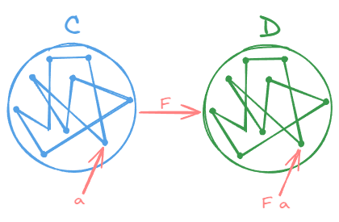
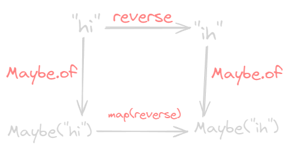

---
tags:
  - functional
gardening: 🌱
reference:
  - https://github.com/MostlyAdequate/mostly-adequate-guide
---
## Chapter 1: What Ever Are We Doing?

```js
const conjoin = (flockX, flockY) =>
  flockX + flockY;

const breed = (flockX, flockY) =>
  flockX * flockY;

const flockA = 4;
const flockB = 2;
const flockC = 0;
const result = conjoin(
  breed(flockB, conjoin(flockA, flockC)), breed(flockA, flockB)
);
```

There is benefit to calling a spade a spade. Had we scrutinized our custom functions more closely, we would have discovered that we're just working with simple addition (`conjoin`) and multiplication (`breed`).

There's really nothing special about these two functions other than their names.

```js
const add = (x, y) => x + y;
const multiply = (x, y) => x * y;

const flockA = 4;
const flockB = 2;
const flockC = 0;
const result = add(
  multiply(flockB, add(flockA, flockC)), multiply(flockA, flockB)
);
```

And with that, we gain the knowledge of the ancients.

```js
// associative
add(add(x, y), z) === add(x, add(y, z));

// commutative
add(x, y) === add(y, x);

// identity
add(x, 0) === x;

// distributive
multiply(x, add(y, z)) === add(multiply(x, y), multiply(x, z));
```

Let's see if we can use these properties to simplify our little seagull program.

```js
// Original line
add(multiply(flockB, add(flockA, flockC)), multiply(flockA, flockB));

// Apply the identity property to remove the extra add
// (add(flockA, flockC) == flockA)
add(multiply(flockB, flockA), multiply(flockA, flockB));

// Apply distributive property to achieve our result
multiply(flockB, add(flockA, flockA));
```

We'll want to represent our specific problem in terms of generic, composable bits and then exploit their properties for our own selfish benefit. It will take a bit more discipline than the "anything goes" approach of imperative programming. The payoff of working within a principled, mathematical framework will truly astound you.

## Chapter 2: First Class Functions

We can treat functions like any other data type and there is nothing particularly special about them - they may be stored in arrays, passed around as function parameters, assigned to variables, and what have you.

A solid understanding of this is critical before moving on, so let's examine a few more examples.

```js
const getServerStuff = callback => ajaxCall(json => callback(json));

// this line
ajaxCall(json => callback(json));

// is the same as this line
ajaxCall(callback);

// so refactor getServerStuff
const getServerStuff = callback => ajaxCall(callback);

// ...which is equivalent to this
const getServerStuff = ajaxCall;
```

And that, folks, is how it is done.

```js
const BlogController = {
  index(posts) { return Views.index(posts); },
  show(post) { return Views.show(post); },
  create(attrs) { return Db.create(attrs); },
  update(post, attrs) { return Db.update(post, attrs); },
  destroy(post) { return Db.destroy(post); }
};
```

This is 90% fluff.

```js
const BlogController = {
  index: Views.index,
  show: Views.show,
  create: Db.create,
  update: Db.update,
  destroy: Db.destroy,
};
```

## Chapter 03: Pure Happiness with Pure Functions

A pure function is a function that, given the same input, will always return the same output and does not have any observable side effect. Take `slice` and `splice`, are two functions that do the exact same thing - in a vastly different way. We say `slice` is _pure_ because it returns the same output per input every time. `splice`, however, will chew up its array and spit it back out forever changed which is an observable effect.

```js
const xs = [1, 2, 3, 4, 5];

// pure
xs.slice(0, 3); // [1, 2, 3]
xs.slice(0, 3); // [1, 2, 3]
xs.slice(0, 3); // [1, 2, 3]

// impure
xs.splice(0, 3); // [1, 2, 3]
xs.splice(0, 3); // [4, 5]
xs.splice(0, 3); // []
```

In functional programming, we dislike unwieldy functions like `splice` that _mutate_ data. This will never do as we're striving for reliable functions that return the same result every time.

```js
// impure
const minimum = 21;
const checkAge = age => age >= minimum;

// pure
const checkAge = age => {
  const minimum = 21;
  return age >= minimum;
};

// [better]
const compareAge = minimum => age => age >= minimum;
const checkAge = compareAge(21);
```

In the impure portion, it depends on system state which is disappointing because it increases the cognitive load by introducing an external environment. It might not seem like a lot in this example, but this reliance upon state is one of the largest contributors to system complexity. This may return different results depending  on factors external to input, which not only disqualifies if from being pure, but also puts our minds through the ringer each time we're reasoning about the software.

Its pure form, on the other hand, is completely self sufficient. We can also make `minimum` immutable, which preserves the purity as the state will never change.

We'll be referring to _effect_ as anything that occurs in our computation other than the calculation of a result. There's nothing intrinsically bad about effects and we'll be using  them all over the place in the chapters to come. It's that _side_ part that bears the negative connotation.

A _side effect_ is a change of system state or _observable interaction_ with the outside world that occurs during the calculation of a result.

Side effects may include, but are not limited to:

- changing the file system
- inserting a record into a database
- making an http call
- mutations
- printing to the screen/logging
- obtaining user input
- querying the DOM
- accessing system state

Any interaction with the world outside of a function is a side effect. The philosophy of functional programming postulates that side effects are a primary cause of incorrect behavior. It is not that we're forbidden to use them, rather we want to contain them and run them in a controlled way.

A function is a special relationship between values: Each of its input values gives back exactly one output value.


Pure functions _are_ mathematical functions and they're what functional programming is all about. Programming with these little angels can provide huge benefits.

Pure functions can always be cached by input. This is typically done using a technique called memoization.

```js
const squareNumber = memoize(x => x * x);

squareNumber(4); // 16
squareNumber(4); // 16, returns cache for input 4
squareNumber(5); // 25
squareNumber(5); // 25, returns cache for input 5
```

A simplified implementation.

```js
const memoize = f => {
  const cache = {};

  return (...args) => {
    const argStr = JSON.stringify(args);
    cache[argStr] = cache[argStr] || f(...args);
    return cache[argStr];
  };
};
```

Pure functions are completely self contained. Everything the function needs is handed to it on a silver platter. Pure function must be honest about its dependencies and, as such, tell us exactly what it's up to. We're forced to "inject" dependencies, or pass them in  as arguments, which makes our app much more flexible because we've parameterized.

Contrary to "typical" methods and procedures in imperative programming rooted deep in their environment via state, dependencies and available effects, pure functions can be run anywhere our hearts desire.

"The problem with object-oriented languages is they've got all this implicit environment that they carry around with them. You wanted a banana but what you got was a gorilla holding the banana...and the entire jungle." Erlang creator, Joe Armstrong.

Pure functions make testing much easier. We don't have to mock a "real" payment gateway or setup and assert the state of the world after each test. We simply give the function input and assert output. In fact. We find the functional community pioneering new test tools that can blast our functions with generated input and assert that properties hold on the output.

Many believe the biggest win when working with pure functions is [referential transparency](../computer%20science/programming%20lang%20theory/Referential%20Transparency.md). Code is referentially transparent when it can be substituted for its evaluated value without changing the behavior of the program.

We can use a technique called _equational reasoning_ wherein one substitutes "equals for equals" to reason about code. This ability to reason about code is terrify for refactoring and understanding code in general.

We can run any pure function in parallel since it does not need access to shared memory and it cannot, by definition, have a race condition due to some side effect.

## Chapter 04: Currying

The concept is simple: You can call a function with fewer arguments than it expects. It returns a function that takes the remaining arguments.

> [!NOTE]
> This isn't, strictly speaking, correct. [Currying](../../mathematics/Algebra/Curry.md) is always one by one. [Partial](../../mathematics/Algebra/Curry.md#contrast-with-partial-function-application) is the function being wrapped plus one argument. And then takes the rest one by one.

```js
const add = x => y => x + y;

const increment = add(1);

increment(2); // 3
```

Here we've made a function `add` that takes one argument and returns a function. By calling it, the returned function remembers the first argument from then on via the closure.

```js
const match = curry((what, s) => s.match(what));
const filter = curry((f, arr) => arr.filter(f));
const map = curry((f, arr) => arr.map(f));
```

The pattern I've followed is a simple, but important one. I've strategically positioned the data we're operating on (String, Array) as the last argument. It will become clear as to why upon use.

> [!NOTE]
> Since it wasn't really covered later, the above concept is called "[data last](../../programming/functional/Data%20Last.md)". This allows us to add all of the arguments that are more likely to be static first. And then finally, the value that is ultimately going to be acted up.

Currying is useful for many things. We can make new function just by giving our base function some arguments. We also have the ability to transform any function that works on single elements into a function that works on arrays simply by wrapping it with `map`.

Giving a function fewer arguments than it expects is typically called _partial application_. Partially applying a function can remove a lot of boiler plate code.

> [!NOTE]
> Again, this isn't entirely correct.

## Chapter 05: Coding by Composing

```js
const compose = (f, g) => x => f(g(x));
```

The composition of two functions returns a new function. This makes perfect sense: composing two units of some type should yield a new unit of that very type.

In our definition of `compose`, the `g` will run before the `f`, creating a right to left flow of data. This is much more readable than nesting a bunch of function calls. We could define a left to right version, however, we mirror the mathematical version much more closely as it stands. That's right, composition is straight from the math books.

```js
// associativity
compose(f, compose(g, h)) === compose(compose(f, g), h);
```

Composition is associative, meaning it doesn't matter how you group two of them. So, should we choose to uppercase the string, we can write:

```js
compose(toUpperCase, compose(head, reverse));
// or
compose(compose(toUpperCase, head), reverse);
```

Applying the associative property gives us this flexibility and peace of mind that the result will be equivalent. One pleasant benefit of associativity is that any group of functions can be extracted and bundled together in their very own composition.

```js
const loudLastUpper = compose(exclaim, toUpperCase, head, reverse);

// or ----------------------

const last = compose(head, reverse);
const loudLastUpper = compose(exclaim, toUpperCase, last);

// or ----------------------

const last = compose(head, reverse);
const angry = compose(exclaim, toUpperCase);
const loudLastUpper = compose(angry, last);
```

There's no right wrong answers - we're just plugging our legos together in whatever way we please. Usually it's best to group things in a reusable way like `last` and `angry`.

### Point-free

Point-free style means never having to say your data. It means functions that never mention the data upon which they operate. First class functions, currying, and composition all play well together to create this style. What we're doing is piping our data through each function of 1 argument. Currying allows us to prepare each function to just take its data, operate on it, and pass it along.

Point-free is a good litmus test for functional code as it lets us know we've got small functions that take input to output. One can't compose a while loop, for instance. Be warned, however, point-free is a double-edged sword and can sometimes obfuscate intention. Not all functional code is point-free and that is O.K.

### Debugging

If you are having trouble debugging a composition, we can use this helpful, but impure trace function to see what's going on.

```js
const trace = curry((tag, x) => {
  console.log(tag, x);
  return x;
})
```

### Category Theory

Category theory is an abstract branch of mathematics that can formalize concepts from several different branches such as set theory, type theory, group theory, logic, and more. It primarily deals with objects, morphisms and transformations, which mirrors programming quite closely. Here is a chart of the same concepts as viewed from each separate theory.

| Types                         | Logic                         | Sets                                     | Homotopy           |
| ----------------------------- | ----------------------------- | ---------------------------------------- | ------------------ |
| $A$                           | proposition                   | set                                      | space              |
| $a : A$                       | proof                         | element                                  | point              |
| $B(x)$                        | predicate                     | family of sets                           | fibration          |
| $b(x) : B(x)$                 | conditional proof             | family of elements                       | section            |
| $0,1$                         | $\bot, \top$                  | $\oslash, \{\oslash\}$                   | $\oslash, *$       |
| $A + B$                       | $A \vee B$                    | disjoint union                           | coproduct          |
| $A \times B$                  | $A \wedge B$                  | set of pairs                             | product space      |
| $A \to B$                     | $A \Rightarrow B$             | set of functions                         | function space     |
| $\sum_{(x : A)}\text{ }B(x)$  | $\exists_{x : A}\text{ }B(x)$ | disjoint sum                             | total space        |
| $\prod_{(x : A)}\text{ }B(x)$ | $\forall_{x : A}\text{ }B(x)$ | product                                  | space of sections  |
| $\text{Id}_A$                 | $\text{equality} =$           | $\{\text{ }(x,x) \mid x \in A\text{ }\}$ | path space $A^{1}$ |

In category theory, we have something called... a category. It is defined as a collection with the following components:

- A collection of objects
- A collection of morphisms
- A notion of composition on the morphisms
- A distinguished morphism called identity

**A collection of objects**

The objects will be data types. For instance, `String`, `Boolean`, `Number`, `Object`, etc. We often view data types as sets of all the possible values. One could look at `Boolean` as the set of `[true, false]` and `Number` as the set of all possible numeric values.

**A collection of morphisms**

The morphisms will be our standard every day pure functions.

**A notion of composition on the morphisms**

This, as you may have guessed, is our brand new toy - `compose`. The `compose` function is associative which is no coincidence as it is a property that must hold for any composition in category theory.

**A distinguished morphism called identity**

Let's introduce a useful function called `id`. This function simply takes some input and spits it back at you.

```js
const id = x => x;
```

For now think of it as a function that can stand in for our value - a function masquerading as every day data.

```js
// identity
compose(id, f) === compose(f, id) === f;
```

## Chapter 06: Example Application

Declarative, as opposed to imperative, means that we will write expressions, as opposed to step by step instructions. Think of SQL. There is no "first do this, then do that". There is one expression that specifies what we'd like from the database. We don't decide how to do the work, it does.

```js
// imperative
const makes = [];
for (let i = 0; i < cars.length; i += 1) {
  makes.push(cars[i].make);
}

// declarative
const makes = cars.map(car => car.make);
```

This leaves wiggle room for support code changes and results in our application code being a high level specification. Because we are not encoding order of evaluation, declarative coding lends itself to parallel computing. This coupled with pure functions is why FP is a good option for parallel future.

There is a law regarding map and composition:

```js
// map's composition law
compose(map(f), map(g)) === map(compose(f, g));
```

## Chapter 07: Hindley-Milner and Me

Types are the meta language that enables people from different backgrounds to communicate succinctly and effectively. For the most part, they're written with a system called "Hindley-Milner".

When working with pure functions, type signatures have an expressive power. In a single, compact line, they expose behavior and intention. We can derive "free theorems" from them. Types can be inferred so there's no need to explicit type annotations. They can be turned to fine point precision or left general and abstract. Type signatures thus play an important part in functional programming - much more than you might first expect.

[Hindley-Milner](../../computer%20science/type%20theory/Hindley-Milner%20Type%20System) type signatures are quite simple, but warrants a quick explanation and some practice to fully absorb the little language.

```js
// capitalize :: String -> String
const capitalize = s => toUpperCase(head(s)) + toLowerCase(tail(s));
```

In Hindley-Milner, functions are written as `a -> b` where `a` and `b` are variables for any type. So the signatures for `capitalize` can be read as "a function from `String` to `String`". In other words, it takes a `String` as its input and returns a `String` as its output.

```js
// strLength :: String -> Number
const strLength = s => s.length;

// join :: String -> [String] -> String
const join = curry((what, arr) => arr.join(what));

// match :: Regex -> String -> [String]
const match = curry((reg, s) => s.match(reg));

// replace :: Regex -> String -> String -> String
const replace = curry((reg, sib, s) => s.replace(reg, sub));
```

An interesting thing is going on that I'd like to take moment to explain. For `match` we are free to group the signature like so:

```js
// match :: Regex -> (String -> [String])
const match = curry((reg, s) => s.match(reg));
```

Grouping the last part in parenthesis reveals more information. Now it is seen as a function that takes a `Regex` and returns us a function from `String` to `[String]`. Because of currying, this is indeed the case.

```js
// match :: Regex -> (String -> [String])
const match = curry((reg, s) => s.match(reg));

// onHoliday :: String -> [String]
const onHoliday = match(/holiday/ig);
```

Each argument pops one type off the front of the signature. `onHoliday` is `match` that already has a `Regex`.

```js
// id :: a -> a
const id = x => x;

// map :: (a -> b) -> [a] -> [b]
const map = curry((f, arr) => arr.map(f));
```

The `id` function takes any old type `a` and returns something of the same type `a`. We're able to use variables in types just like in code. Variable names like `a` and `b` are convention, but they are arbitrary can can be replaced with whatever name you'd like. If they are the same variable, they have to be the same type. That's an important rule so let's reiterate: `a -> b` can be any type `a` to any type `b`, but `a -> a` means it has to be the same type. For example, `id` may be `String -> String` or `Number -> Number`, but not `String -> Bool`.

`map` similarly uses type variables, but this time we introduce `b` which may or may not be the same type as `a`. We can read it as: `map` takes a function from any type `a` to the same or different type `b`, then takes an array of `a`'s and results in an array of `b`'s.

Once a type variable is introduced, there emerges a curious property called parametricity. This property states that a function will act on all types in a uniform manner.

```js
// head :: [a] -> a
```

`a` says it cannot be a _specific_ type, which means it can be any type, which leaves us with a function that must work uniformly for _every_ conceivable type. This is what parametricity is all about.

From the type signature, what could it possibly be up to? Again, it cannot do anything specific to `a`. It cannot change `a` to a different type or we'd introduce a `b`.

### Free as in Theorem

Besides deducing implementation possibilities, this sort of reasoning gains us _free theorems_. What follows are a few random example theorems lifted directly from Wadler's paper on the subject.

```js
// head :: [a] -> a
compose(f, head) === compose(head, map(f));

// filter :: (a -> Bool) -> [a] -> [a]
compose(map(f), filter(compose(p, f))) === compose(filter(p), map(f));
```

The first one says that if we get the `head` of our array, then run some function `f` on it, that is equivalent to, and incidentally, much faster than, if we first `map(f)` over every element then take the `head` of the result.

Computers must have a formal way to automate these kind of code optimizations. Maths has a way of formalizing the intuitive, which is helpful amidst the rigid terrain of computer logic.

The `filter` theorem is similar. It says that if we compose `f` and`p` to check which should be filtered, then actually apply the `f` via `map`, it will always be equivalent to mapping our `f` then filtering the result with the `p` predicate.

### Constraints

One last thing to note is that we can constrain types to an interface.

```js
// sort :: Ord a => [a] -> [a]
```

What we see on the left side of our fat arrow here is a statement of fact: `a` must be an `Ord`. Or in other words, `a` must implement the `Ord` interface. What is `Ord` and where did it come from? In a typed language it would be a defined interface that says we can order the values. This not only tells us more about the `a` and what our `sort` function is up to, but also restricts the domain. We call these interface declarations _type constraints_.

```js
// assertEqual :: (Eq a, Show a) => a -> a -> Assertion
```

## Chapter 08: Tupperware

What about control flow, error handling, asynchronous actions, state and effects. First we will create a container. This container must hold any type of value. It will be an object, but we will not give it properties and methods in the OO sense. We will treat it like a treasure chest - a special box that cradles our valuable data.

```js
class Container {
  constructor(x) {
    this.$value = x;
  }

  static of(x) {
    return new Container(x);
  }
}
```

We will use `Container.of` as a constructor which saves us from having to write that awful `new` keyword all over the place. Let's make a few things clear before we move on:

- `Container` is an object with one property. Lots of containers just hold one thing, though they aren't limited to one. We've arbitrarily named its property `$value`.

- The `$value` cannot be one specific type or out `Container` would hardly live up to the name.

- Once data goes into the `Container` it stays there. We _could_ get it out by using `.$value`, but that would defeat the purpose.

### My First Functor

Once our value is in the container, we'll need a way to run functions on it.

```js
// (a -> b) -> Container a -> Container b
Container.prototype.map = function (f) {
  return Container.of(f(this.$value));
}
```

It's just like Array's famous `map`, except we have `Container a` instead of `[a]`. And it works essentially the same way:

```js
Container.of(2).map(two => two + s);
// Container(4)

Container.of('flamethrowers').map(s => s.toUpperCase());
// Container('FLAMETHROWER');

Container.of('bomb').map(concat(' away')).map(prop('length'));
// Container(10)
```

We can work with our value without ever having to leave the `Container`. Our value in the `Container`  is handed to the `map` function so we can fuss with it and afterward, returned to its `Container` for safe keeping. As a result of never leaving the `Container`, we can continue to `map` away, running functions as we please. We can even change the type as we go along.

A Functor is a type that implements `map` and obeys some laws.

_Functor_ is simply an interface with a contract. Functors come from category theory and we'll look at the maths in detail toward the end of the chapter, let's work on intuition and practical uses for this bizarrely named interface. What do we gain from asking our container to apply functions for us? Well, abstraction of function application. When we `map` a function, we ask the container type to run it for us.

`Container` is fairly boring. In fact, it is usually called `Identity` and has about the same impact as our `id` function.

```js
class Maybe {
  static of(x) {
    return new Maybe(x);
  }

  get isNothing() {
    return this.$value == null;
  }

  constructor(x) {
    this.$value = x;
  }

  map(fn) {
    return this.isNothing ? this : Maybe.of(fn(this.$value));
  }

  inspect() {
    return this.isNothing ? 'Nothing' : `Just(${this.$value})`;
  }
}
```

### Schrodinger's Maybe

`Maybe` looks a lot like `Container` with one minor change: it will first check to see if it has a value before calling the supplied function. This has the effect of side stepping those pesky nulls as we `map`.

```js
Maybe.of({ name: 'Boris' }).map(prop('age')).map(add(10));
// Nothing

Maybe.of({ name: 'Dinah', age: 14 }).map(prop('age')).map(add(10));
// Just(24)
```

Notice our app doesn't explode with errors as we map functions over our null values. This is because `Maybe` will take care to check for a value each and every time is applies a function.

This dot syntax is perfectly fine and functional, we'd like to maintain our point-free style. `map` is fully equipped to delegate to whatever functor it receives.

```js
// map :: Functor f => (a -> b) -> f a -> f b
const map = curry((f, anyFunctor) => anyFunctor.map(f));
```

This is delightful as we can carry on with composition per usual and `map` will work as expected.

```js
// safeHead :: [a] -> Maybe(a)
const safeHead = xs => Maybe.of(xs[0]);

// streetName :: Object -> Maybe String
const streetName = compose(map(prop('street')), safeHead, prop('addresses'));

streetName({ addresses: [] });
// Nothing

streetName({ addresses: [{ street: 'Shady Ln', number: 4201 }] });
// Just('Shady Ln')
```

The `safeHead` function is honest and up front about its possible failure and so it returns a `Maybe` to inform us of this matter. We are more than merely _informed_, however, because we are forced to `map` to get at the value we want since it is tucked away inside the `Maybe` object. Essentially, this is a `null` check enforced by the `safeHead` function itself. We can now sleep better at night knowing a `null` value won't rear its ugly, decapitated head when we least expect it. They will guarantee safer software.

We can give `Nothing` back to signal failure and out application effectively halts in its tracks. This is important to note: if a function fails, then `map` will sever the rest of the computation since it doesn't ever run the mapped functions. This is precisely the intended behavior as we'd prefer not to continue if something fails.

### Releasing the Value

One thing people often miss is that there will always be an end of the line; some effecting function that sends JSON along, or prints to the screen, or alters our file system, or what have you. We cannot deliver the output with `return`, we must run some function or another to send it out into the world. A common error is to try to remove the value from our `Maybe` one way or another as if the possible value inside will suddenly materialize. We must understand it may be a branch of code where our value is not around to live up to its destiny. Our code, must like Schrodinger's cat, is in two states at once and should maintain that fact until the final function. This gives our code a linear flow despite the logical branching. There is, however, an escape hatch.

```js
// maybe :: b -> (a -> b) -> Maybe a -> b
const maybe = curry((v, f, m) => {
  if (m.isNothing) {
    return v;
  }

  return f(m.$value);
})
```

> [!NOTE]
> This is usually a function that is on the Maybe itself. Usually called `orElse` or something similar. You still don't want to reach into a Monad from the outside.

We will now either return a static value or continue on merrily finishing up the transaction sans `Maybe`. With `maybe`, we are witnessing the equivalent of an `if/else` statement whereas with `map`, the imperative analog would be: `if (x !== null) { return f(x); }`.

The introduction of `Maybe` can cause some initial discomfort. Users of Swift and Scala will know what I mean as it's baked right into the core libraries under the guise of `Option(al)`. Most people can't help but feel it's a tad laborious. However, with time, it will become second nature and you'll likely appreciate the safety. After all, most of the time it will prevent cut corners and save our hides.

You'll often see types like `Some(x) / None` or `Just(x) / Nothing` instead of a `Maybe` that does a `null` check on its value.

### Pure Error Handling

It may come as a shock. but `throw / catch` is not very pure. When an error is thrown, instead of returning an output value, we sound the alarms. With our new friend `Either`, we can do better than to declare war on input, we can respond with a polite message.

```js
class Either {
  static of(x) {
    return new Right(x);
  }

  constructor(x) {
    this.$value = x;
  }
}

class Left extends Either {
  map(f) {
    return this;
  }

  inspect() {
    return `Left(${this.$value})`;
  }
}

class Right extends Either {
  map(f) {
    return Right.of(f(this.$value));
  }

  inspect() {
    return `Right(${this.$value})`;
  }
}
```

`Left` and `Right` are two subclasses of an abstract type we call `Either`. `Left` ignores our request to `map` over it. `Right` will work just like `Container`. The power comes from the ability to embed an error message within the `Left`. 

```js
const left = x => new Left(x);

const getAge = curry((now, user) => {
  const birthDate = new Date(user.birthDate);

  return isValid(birthDate)
    ? Either.of(diff(Date.now(), birthDate))
    : left('Birth date could not be parsed');
});
```

> [!NOTE]
> I usually prefer to do the `left` portion in the classes themselves. Usually by check instance of Error and making a Left out of that. Or `Either(left, right)` type of thing.

Just like `Nothing`, we are short-circuiting our app when we return a `Left`. The difference, is now we have a clue as to why our program has derailed.

When the `birthDate` is valid, the program outputs its mystical fortune to the screen for us to behold. Otherwise, we are handed a `Left` with the error message plain as day though still tucked away in its container. That acts just as if we'd thrown an error, but in a calm, mild manner fashion as opposed to losing its temper and screaming like a child when something does wrong.

In this example, we are logically branching our control flow depending on the validity of the birth date, yet it reads as one linear motion from right to left rather than climbing through the curly braces of a conditional statement.

At the time of calling, a function can be surrounded by `map`, which transforms it from a non-functory function to a functory one, in informal terms. We call this process _lifting_. Functions tend to be better off working with normal data types rather than container types, then _lifted_ into the right container as deemed necessary. This leads to simpler, more reusable functions that can be altered to work with any functor on demand.

`Either` captures logical disjunction (`||`) in a type. It also encodes the idea of a _Coproduct_ from category theory. It is the canonical sum type (or disjoint union of sets) because its amount of possible inhabitants is the sum of the two contained types.

Just like with `Maybe`, we have little `either`, which behaves similarly, but takes two functions instead of one and a static value.

```js
// either :: (a -> c) -> (b -> c) -> Either a b -> c
const either = curry((f, g, e) => {
  let result;
  
  switch (e.constructor) {
    case Left:
      result = f(e.$value);
      break;

    case Right:
      result = g(e.$value);
      break;
  }

  return result;
});
```

> [!NOTE]
> Have always seen this called `cata` and it usually lives on the Monad itself. Though a composable version would be helpful.

### Old McDonald Has Effects...

`IO` differs from the previous functors in that the `$value` is always a function.

```js
class IO {
  static of(x) {
    return new IO(() => x);
  }

  constructor(fn) {
    this.$value = fn;
  }

  map(fn) {
    return new IO(compose(fn, this.$value));
  }

  inspect() {
    return `IO(${this.$value})`
  }
}
```

`IO` delays the impure action by capturing it in a function wrapper. As such, we think of `IO` as containing the return value of the wrapped action and not the wrapper itself. This is apparent in the `of` function: we have an `IO(x)`, the `IO(() => x)` is just necessary to avoid evaluation.

When we `map` over our `IO`, we stick that function at the end of a composition which, in turn, becomes the new `$value` and so on. Our mapped functions do not run, they get tacked on the end of a computation we're building up, function by function. The result is reminiscent of Gang of Four's command pattern or a queue.

Mapping over our `IO` has built up a mighty impure computation and running it is surely going to disturb the peace. If we put the onus on the calling code. Our pure code, despite the nefarious plotting and scheming, maintains its innocence and it's the caller who gets burdened with the responsibility of actually running the effects.

```js
// url :: IO String
const url = new IO(() => window.location.href);

// toPairs :: String -> [[String]]
const toPairs = compose(map(split('=')), split('&'));

// params :: String -> [[String]]
const params = compose(toPairs, last, split('?'));

// findParam :: String -> IO Maybe [String]
const findParam = key => map(compose(Maybe.of, filter(compose(eq(key), head)), params), url);

// -- Impure calling code ------------

// run it by calling $value()
findParam('searchTerm').$value();
```

> [!NOTE]
> This you shouldn't really be reaching into a Monad. Whether it is an `IO` or not.

`IO`'s `$value` is the pin in the grenade and it is meant to be pulled by a called in the most public of ways.

```js
class IO {
  constructor(io) {
    this.unsafePerformIO = io;
  }

  map(fn) {
    return new IO(compose(fn, this.unsafePerformIO));
  }
}
```

Now our calling code becomes `findParam('searchTerm).unsafePerformIO()`, which is clear as day to user of the application.

### Asynchronous Tasks

```js
// readFile :: String -> Task Error String
const readFile = filename => new Task((reject, result) => {
  fs.readFile(filename, (err, data) => err ? reject(err) : result(data));
});

Task.of(3).map(three => three + 1);
```

The functions I'm calling `reject` and `result` are our error and success callbacks, respectively. As you can see, we simply `map` over the `Task` to work on the future value as if it was right there in our grasp.

If you're familiar with promises, you might recognize the function `map` as `then` with `Task` playing the role of the promise.

Like `IO`, `Task` will patiently wait for us to give it the green light before running. In fact, because it waits for our command, `IO` is effectively subsumed by `Task` for all things asynchronous. What's more, `Task` works in a similar fashion when we `map` over it; we're placing instructions for the future like a chore chart in  a time capsule - an act of sophisticated technological procrastination.

To run our `Task`, we must call the method `fork`. This works like `unsafePerformIO`, but as the name suggests, it will fork our process and evaluation continues on without blocking our thread.

```js
// blog :: Params -> Task Error HTML
const blog = compose(map(renderPage), getJSON('/posts'));

blog({}).fork(
  error => $('#error').html(error.message),
  page => $('#main').html(page),
);

$('#spinner').show();
```

Upon calling `fork`, the `Task` hurries off to find some posts and render the page. Meanwhile, we show a spinner since `fork` does not wait for a response. Finally, we will either display an error or render the page onto the screen depending if the `getJSON` call succeeded or not.

`Task` has also swallowed up `Either`. It must do so in order to handle futuristic failures since our normal control flow does not apply in the async world. This is all well and good as it provides sufficient and pure error handling out of the box.

All together now.

```js
// Postgres.connect :: Url -> IO DbConnection
// runQuery :: DbConnection -> ResultSet
// readFile :: String -> Task Error String

// dbUrl :: Config -> Either Error Url
const dbUrl = ({ uname, pass, db }) => {
  if (uname && pass && host && db) {
    return Right.of('...');
  }

  return Left.of(Error('Invalid config'));
};

// connectDb :: Config -> Either Error (IO DbConnection)
const connectDb = compose(map(Postgres.connect), dbUrl);

// getConfig :: Filename -> Task Error (Either Error (IO DbConnection))
const getConfig = compose(map(compose(connectDb, JOSN.parse)), readFile);

getConfig('db.json').fork(
  logErr('couldn\'t read file'),
  either(console.log, map(runQuery)),
);
```

In this example, we still make use of the `Either` and `IO` from within the success branch of `readFile`. `Task` takes care of the impurities of reading a file asynchronously, but we still deal with validation the config with `Either` and wrangling the db connection with `IO`.

### A Spot of Theory

As mentioned before, functors come from category theory and satisfy a few laws. Let's first explore these useful properties.

```js
// identity
map(id) === id;

// composition
compose(map(f), map(g)) === map(compose(f, g));
```

The _identity_ law is simple, but important.

```js
const idLaw1 = map(id);
const idLaw2 = id;

idLaw1(Container.of(2)); // Container(2)
idLaw2(Container.or(2)); // Container(2)
```

Next let's look at composition.

```js
const compLaw1 = compose(map(concat(' world')), map(concat(' cruel')));
const compLaw2 = map(compose(concat(' world'), concat(' cruel')));

compLaw1(Container.of('Goodbye'));
compLaw2(Container.of('Goodbye'));
```

In category theory, functors take the objects and morphisms of a category and map them to a different category. By definition, this new category must have an identity and the ability to compose morphisms, but we needn't check because the aforementioned laws ensure these are preserved.

You can think of a category as a network of objects with morphisms that connect them. So a functor would map the one category to the other without breaking the network. If an object `a` is in our source category `c`, when we map it to category `D` with functor `F`, we refer to that object as `F a`.



Each functor in our code maps to a sub category of types and functions which makes all functors a particular brand called endofunctors.


In addition to visualizing the mapped morphism from one category to another under the functor `F`, we see that the diagram commutes, which is to say, if you follow the arrows each route produces the same result. The different routes mean different behavior, but we always end at the same type. This formalism gives us principled ways to reason about our code - we can boldly apply formulas without having to parse and examine each individual scenario.

```js
// topRoute :: String -> Maybe String
const topRoute = compose(Maybe.of, reverse);

// bottomRoute :: String -> Maybe String
const bottomRoute = compose(map(reverse), Maybe.of);

topRoute('hi'); // Just('ih')
bottomRoute('hi'); // Just('ih')
```




Functors can stack:

```js
const nested = Task.of([
  Right.of('pillows'), 
  Left.of('no sleep for you')
]);

map(map(map(toUpperCase)), nested);
// Task([Right('PILLOWS'), Left('no sleep for you')])
```

We see no callbacks, if/else's, or for loops; just an explicit context. We do, however, have to `map(map(map(f)))`. We can instead compose functors.

```js
class Compose {
  constructor(fgx) {
    this.getCompose = fgx;
  }

  static of(fgx) {
    return new Compose(fgx);
  }

  map(fn) {
    return new Compose(map(map(fn), this.getCompose));
  }
}

const tmd = Task.of(Maybe.of('Rock over London'));
const ctmd = Compose.of(tmd);

map(concat(', rock on, Chicago'), ctmd);
// Compose(Task(Just('Rock over London, rock on, Chicago')))

ctmd.getCompose;
// Task(Just('Rock over London, rock on, Chicago'))
```

Functor composition is associative and earlier, we defined `Container`, which is actually called the `Identity` functor. If we have identity and associative composition we have a category. This particular category has categories as objects and functors as morphisms, which is enough to make one's brain perspire. It's nice to appreciate the architectural implications or even just the simple abstract beauty in the pattern.

We've seen a few different functors, but there are infinitely many. Some notable omissions are iterable data structures like trees, lists, maps, pairs. eventstreams and observables are both functors. Others can be for encapsulation or even just type modeling.

## Chapter 09: Monadic Onions

