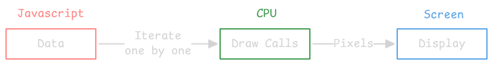
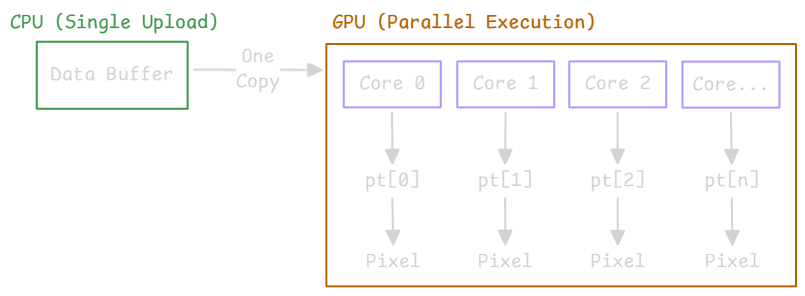
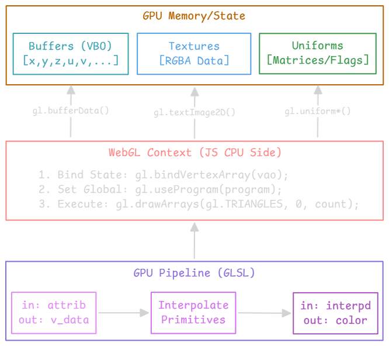
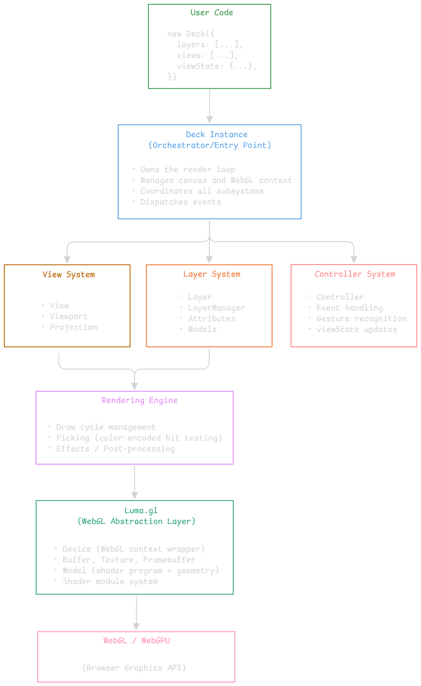
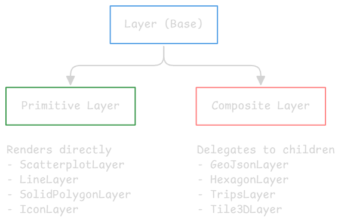
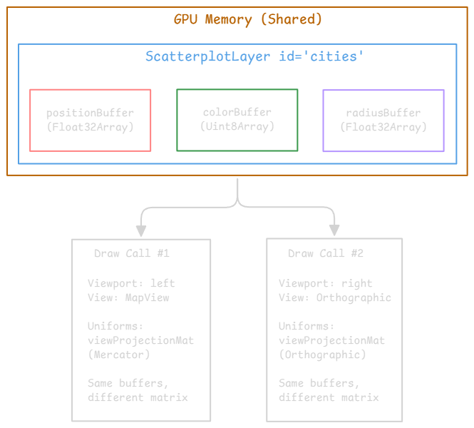
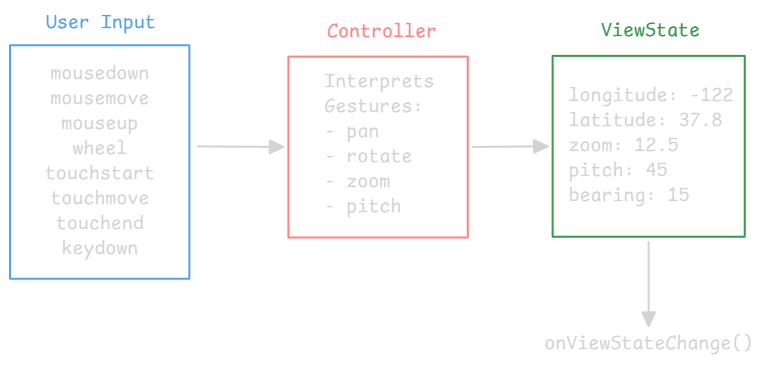
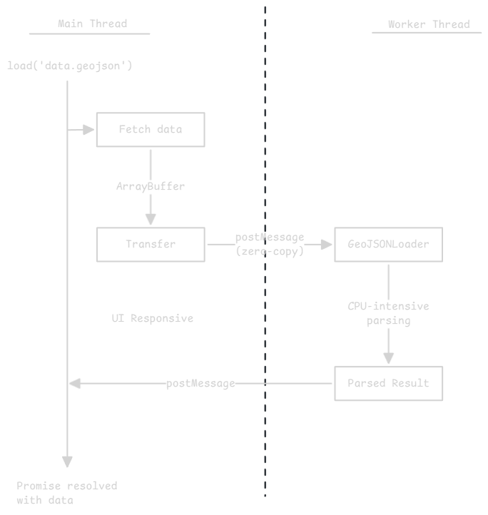

---
tags:
  - deckgl
gardening: 🌳
date: 2025-12-28
reference:
  - https://deck.gl/docs
  - https://luma.gl/docs
  - https://math.gl/docs
  - https://loaders.gl/docs
---
## The Challenge: Large-Scale Geospatial Visualization in the Browser

Consider a concrete problem: You need to render 1 million GPS points on a map in a web browser. Each point represents a taxi pickup in New York City. The user should be able to:
- Pan and zoom smoothly (60 fps)
- Hover over points to see details
- Update the data dynamically (e.g., filter by time of day)

### The Problem: CPU Bottleneck

Traditional web visualization libraries (D3.js, Leaflet markers, etc.) use the **DOM** or **Canvas 2D API**. Both approaches hit fundamental scaling limits.



For each point:
- Read the position from a JS array
- Transform coordinates
- Issue draw command
- Rasterize shape

The bottleneck is **CPU-bound iteration**. The CPU must sequentially process each data point, and each draw call incurs overhead from the JavaScript-to-native boundary crossing.

### The Solution: GPU Parallelism

GPUs solve this through **massive parallelism**. A modern GPU has thousands of cores that can execute the same operation on different data simultaneously. This is the **SIMD** (Single Instruction, Multiple Data) paradigm.



The key insight, **move computation from the CPU to the GPU**.

### WebGL: Browser's GPU Interface

WebGL is a JavaScript API that exposes OpenGL ES functionality to the browser. It allows JavaScript to:
1. **Upload data** to GPU memory (as "buffers")
2. **Upload programs** to run on the GPU (as "shaders")
3. **Issue draw calls** that execute those programs on that data



### The Problem with Raw WebGL

WebGL is powerful but **extremely low-level**. Rendering a single colored triangle requires approximately 50-100 lines of boilerplate:
1. Create shaders (vertex + fragment) as strings
2. Compile shaders, check for errors
3. Create program, link shaders, check for errors
4. Create buffer, bind buffer, upload vertex data
5. Get attribute locations, enable attributes, set attribute pointers
6. Set uniforms (transformation matrices, colors, etc.)
7. Configure viewport, clear color, depth testing
8. Issue draw call

For data visualization specifically, additional challenges arise:

| Challenge              | Description                                                        |
| ---------------------- | ------------------------------------------------------------------ |
| **Coordinate Systems** | Geographic coords (lat/lng) → Web Mercator → screen pixels         |
| **Dynamic Data**       | Data changes; must efficiently update GPU buffers                  |
| **Interactivity**      | Picking (which point did the user click?) requires reverse mapping |
| **Layering**           | Multiple visualization layers with proper depth ordering           |
| **Performance**        | Minimizing draw calls, efficient buffer updates, avoiding stalls   |

### Deck.gl's Value Proposition

Deck.gl provides a **high-level, declarative API** for GPU-accelerated visualization while handling all the complexity above. It was created at Uber (circa 2016) to power their internal visualization tools for analyzing ride data at scale.

The core abstraction is the **Layer**.

```typescript
import { ScatterplotLayer } from '@deck.gl/layers';

const layer = new ScatterplotLayer({
  id: 'taxi-pickups',
  data: taxiData,                    // 1 million points
  getPosition: d => d.coordinates,   // Accessor function
  getRadius: d => d.passengerCount,
  getFillColor: [255, 140, 0],
  radiusMinPixels: 1,
});
```

From this declarative specification, Deck.gl:
1. Extracts positions by calling `getPosition` on each datum
2. Packs the data into typed arrays with proper memory layout
3. Uploads to GPU buffers
4. Generates or selects appropriate shaders
5. Manages coordinate transformations
6. Handles picking, updates, and lifecycle

The developer thinks in terms of **data and visual mappings**; Deck.gl handles the GPU machinery.

## Deck.gl's Architecture

Deck.gl is organized into distinct subsystems with clear responsibilities.




**_Docs_ [1](https://deck.gl/docs/developer-guide/custom-layers/layer-lifecycle) [2](https://deck.gl/docs/developer-guide/custom-layers/primitive-layers) [3](https://deck.gl/docs/developer-guide/custom-layers/attribute-management)**

### Deck Instance

The `Deck` class is the entry point and orchestrator. It owns:

1. **The canvas element** (or accepts an existing one)
2. **The WebGL context** (via luma.gl's `Device`)
3. **The animation loop** (requestAnimationFrame-based render cycle)
4. **References to all subsystems**

```typescript
import { Deck } from '@deck.gl/core';

const deck = new Deck({
  // Canvas configuration
  canvas: 'deck-canvas',  // ID or HTMLCanvasElement
  width: '100%',
  height: '100%',
  
  // Initial state
  initialViewState: {
    longitude: -122.4,
    latitude: 37.8,
    zoom: 12,
  },
  
  // What to render
  layers: [
    new ScatterplotLayer({ ... }),
  ],
  
  // How to project
  views: [
    new MapView({ id: 'main' }),
  ],
  
  // Event callbacks
  onHover: (info) => { ... },
  onClick: (info) => { ... },
  onViewStateChange: ({ viewState }) => { ... },
  
  // Lifecycle callbacks
  onLoad: () => { ... },
  onError: (error) => { ... },
});
```

The Deck instance is **stateful but declaratively configured**. You update it by calling `deck.setProps({ layers: [...] })`. Deck.gl diffs the new props against the old and updates only what changed.

**_(Docs [1](https://deck.gl/docs/api-reference/core/deck))_**

### Layer System

Layers are the core abstraction. Each layer:
1. **Consumes data** (array of objects, typed arrays, Arrow tables, etc.)
2. **Maps data to visual properties** (via accessors)
3. **Manages GPU resources** (buffers, textures)
4. **Renders geometry** (via luma.gl Models)



**Primitive layers** are the workhorses. They own shader programs and issue draw calls. **Composite layers** are conveniences that construct and manage primitive layers.

The **LayerManager** orchestrates all layers:
- Tracks layer instances across renders
- Matches old layers to new layers by `id`
- Triggers lifecycle methods
- Manages resource cleanup

**_(Docs [1](https://deck.gl/docs/developer-guide/using-layers))_**

### View System

The View system handles **projection from world coordinates to screen pixels**. It has three components.


#### View

Defines WHAT kind of projection and WHERE on the screen
- MapView - Web Mercator projection (standard web maps)
- FirstPersonView - First-person camera perspective
- OrbitView - Object-centric orbital camera
- OrthographicView - 2D orthographic (no perspective)
- GlobeView - Experimental 3D globe

#### View State

The camera parameters (user-controlled, changes on interaction)

For MapView:
- longitude
- latitude
- zoom
- pitch
- bearing
- minZoom, maxZoom

For OrbitView:
- target: \[x, y, z]
- rotationX (pitch)
- rotationOrbit (yaw)
- zoom
- minZoom, maxZoom

#### Viewport

Computed from View + ViewState. Contains the actual transformation matrices.

Key matrices:
- viewMatrix - Camera position/orientation
- projectionMatrix - Perspective/orthographic projection
- viewProjectionMatrix - Combined (passed to shaders)

Key methods:
- `project([lng, lat, z])` → `[x, y, depth]`
- `unproject([x, y, depth])` → `[lng, lat, z]`

#### Multi-View

The architecture explicitly separates **what** (Layers/data) you see from **how** (Views/projection) you see it.



**_(Docs [1](https://deck.gl/docs/developer-guide/views) [2](https://deck.gl/docs/api-reference/core/view) [3](https://deck.gl/docs/api-reference/core/viewport) [4](https://deck.gl/docs/roadmap#multi-viewport-support))_**

### Controller System

Controllers translate **user input** (mouse, touch, keyboard) into **viewState changes**.



Controllers are associated with Views.

```typescript
new Deck({
  views: [
    new MapView({
      id: 'map',
      controller: {
        type: MapController,
        dragPan: true,
        dragRotate: true,
        scrollZoom: true,
        doubleClickZoom: true,
        touchRotate: true,
        keyboard: true,
        inertia: 300,
      },
    }),
  ],
});
```

#### What Changes

For example, what has to update when a user zooms or pans the map:

**Changes every frame during interaction:**
- ViewState: `{ longitude, latitude, zoom, pitch, bearing }`
- Viewport: viewMatrix, projectionMatrix, viewProjectionMatrix
- Uniforms: shader uniform values (matrix upload per draw call)

**Unchanged, preserved across frames:**
- View: MapView instance (defines projection type)
- Layer: Layer instances and their state
- Attributes: GPU buffers (positions, colors, radii, etc.)
- Models: Compiled shader programs
- Textures: Icon atlases, images, etc.


**_(Docs [1](https://deck.gl/docs/developer-guide/interactivity) [2](https://deck.gl/docs/api-reference/core/controller))_**

### Rendering Pipeline

When a frame renders, this sequence occurs:

1. Animation Frame
   └─▶ requestAnimationFrame callback fires

2. Update Phase
   ├─▶ Process pending setProps() calls
   ├─▶ Diff layers (match by id, detect adds/removes/updates)
   ├─▶ Run layer lifecycle:
   │ • initializeState() for new layers
   │ • updateState() for changed layers
   │ • finalizeState() for removed layers
   └─▶ Update GPU buffers (AttributeManager)

3. Viewport Computation
   ├─▶ For each View, compute Viewport from viewState
   └─▶ Generate view-projection matrices

4. Draw Phase
   ├─▶ Clear framebuffer
   ├─▶ For each Viewport:
   │ ├─▶ Set WebGL viewport/scissor
   │ ├─▶ For each Layer (sorted by render order):
   │ │ ├─▶ Bind layer's shader program
   │ │ ├─▶ Set uniforms (matrices, time, etc.)
   │ │ ├─▶ Bind attribute buffers
   │ │ └─▶ Issue draw call(s)
   │ └─▶ (end layer loop)
   └─▶ (end viewport loop)

5. Post-Process (if effects enabled)
   └─▶ Apply screen-space effects (lighting, bloom, etc.)

6. Picking (if interaction occurred)
   ├─▶ Re-render to offscreen buffer with color-coded IDs
   ├─▶ Read pixel at cursor position
   └─▶ Decode picked layer + object index

## vis.gl Ecosystem

Deck.gl does not implement everything from scratch. It sits atop a stack of companion libraries, each handling a specific domain. Understanding these libraries is essential. All these libraries are maintained under the **vis.gl** umbrella (originally Uber's visualization team, now an independent open governance organization).

**Deck.gl** - Geospatial visualization
├─▶ **loaders.gl** - Data loading and parsing
├─▶ **math.gl** - Linear algebra and geospatial
└─▶ **luma.gl** - WebGL/WebGPU abstraction

Other vis.gl libraries:
- probe.gl - Benchmarking and debugging
- hubble.gl - Video export/animation capture

### luma.gl

luma.gl is the most critical dependency.
- GPU resource abstractions (Buffer, Texture, Framebuffer, Shader)
- Shader module system (composable shader fragments)
- Device abstraction (WebGL2 today, WebGPU tomorrow)
- Rendering utilities (Model, AnimationLoop)

#### Model Class

The Model is the central rendering primitive. It combines:
- A shader program (vertex + fragment shaders)
- Geometry (vertex count, draw mode, index buffer)
- Attributes (vertex buffers)
- Uniforms (constant values for the draw call)

```typescript
import { Model } from '@luma.gl/engine';

const model = new Model(device, {
  vs: `#version 300 es
    in vec2 position;
    in vec3 color;
    out vec3 vColor;
    uniform mat4 uViewProjection;
    
    void main() {
      vColor = color;
      gl_Position = uViewProjection * vec4(position, 0.0, 1.0);
    }
  `,
  fs: `#version 300 es
    precision highp float;
    in vec3 vColor;
    out vec4 fragColor;
    
    void main() {
      fragColor = vec4(vColor, 1.0);
    }
  `,
  vertexCount: 3,
  attributes: {
    position: positionBuffer,
    color: colorBuffer,
  },
});

// Each frame:
model.setUniforms({ uViewProjection: matrix });
model.draw(renderPass);
```

**Every Deck.gl primitive layer creates one or more luma.gl Models.** The layer lifecycle manages these Models, creating them in `initializeState()`, updating their attributes/uniforms in `updateState()`, and destroying them in `finalizeState()`.

**_(Docs [1](https://luma.gl/docs/api-reference/engine/model))_**

##### Shader Module System

luma.gl provides a module system for composing shaders from reusable fragments.

```typescript
const myLightingModule = {
  name: 'myLighting',
  vs: `
    // Vertex shader contributions
    out vec3 vNormal;
  `,
  fs: `
    // Fragment shader contributions
    uniform vec3 uLightDirection;
    
    vec3 applyLighting(vec3 color, vec3 normal) {
      float diffuse = max(dot(normal, uLightDirection), 0.0);
      return color * (0.3 + 0.7 * diffuse);  // Ambient + diffuse
    }
  `,
  uniforms: {
    uLightDirection: [0, 0, 1],
  },
};

// Using modules in a Model
const model = new Model(device, {
  vs: `...`,
  fs: `...`,
  modules: [myLightingModule, picking, project],  // ← Composed
});
```

Deck.gl layers use this extensively. The `project` module (coordinate projection), `picking` module (color-encoded picking), and extension modules are all injected this way.

###### Composing Shaders

The shader module system is like a pipeline, where each module's contribution executes in sequence. luma.gl and Deck.gl use a **hook-based injection system**:

```glsl
void main() {
  vec3 position = instancePositions;
  vec4 color = instanceColors;

  // ─── HOOK: DECKGL_FILTER_SIZE ───────────────────────────────
  //     Extensions can modify 'size' here
  float size = instanceRadius;
  DECKGL_FILTER_SIZE(size, geometry);

  // ─── HOOK: DECKGL_FILTER_GL_POSITION ────────────────────────
  //     Extensions can modify 'gl_Position' here
  gl_Position = project_position_to_clipspace(position);
  DECKGL_FILTER_GL_POSITION(gl_Position, geometry);

  // ─── HOOK: DECKGL_FILTER_COLOR ──────────────────────────────
  //     Extensions can modify 'color' here
  DECKGL_FILTER_COLOR(color, geometry);
  vColor = color;
}
```

Extensions inject code at these hooks. When multiple extensions target the same hook, their code **concatenates in order**.

```typescript
// Layer with two extensions
new ScatterplotLayer({
  extensions: [
    new DataFilterExtension(),   // Injects filter logic
    new BrushingExtension(),     // Injects brushing logic
  ],
});
```

```glsl
// Generated DECKGL_FILTER_COLOR hook (simplified)
void DECKGL_FILTER_COLOR(inout vec4 color, in GeometryInfo geometry) {
  // --- DataFilterExtension contribution (runs first) ---
  if (filterValue < filterRange.x || filterValue > filterRange.y) {
    color.a = 0.0;  // Hide filtered points
  }
  
  // --- BrushingExtension contribution (runs second) ---
  if (!isPointInBrush(geometry.position)) {
    color.a *= 0.1;  // Dim non-brushed points
  }
}
```

The order matters because each extension modifies the value that the next extension receives. It's a fold over the extensions array:

$$\text{finalColor} = f_n(f_{n-1}(\ldots f_1(\text{initialColor})))$$

Where $f_i$ is the transform contributed by extension $i$. e.g. standard function composition.

**_(Docs [1](https://luma.gl/docs/api-guide/shaders/shader-modules))_**

### math.gl

math.gl provides optimized vector/matrix operations and geospatial utilities.

```typescript
import { Vector3 } from '@math.gl/core';

// Vectors
const v = new Vector3(1, 2, 3);
v.normalize();
v.scale(2);
v.dot(otherVector);
v.cross(otherVector);
```

math.gl classes are **mutable** for performance. Methods modify the instance in-place rather than returning new objects. In hot loops (like accessor processing), avoiding allocations is critical.

```typescript
const v = new Vector3();
v.set(1, 2, 3);      // Modifies v
v.normalize();       // Modifies v
v.scale(2);          // Modifies v
```

The `WebMercatorViewport` class is especially important, it's the foundation for Deck.gl's MapView projection.

### loaders.gl

loaders.gl is a suite of loaders for various data formats, designed for large-scale geospatial data.

`load()`/`parse()` - Entry point
└─▶ Loader Selection - by extension, MIME type or explicit
    ├─▶ GeoJson Loader
    ├─▶ Shapefile Loader
    ├─▶ glTF Loader
    ├─▶ Arrow Loader
    └─▶ 3D Tiles

Format Categories:
- Geospatial Vector: GeoJSON, Shapefile, KML, GPX, WKT/WKB, FlatGeobuf
- Geospatial Raster: GeoTIFF, Terrain (Quantized Mesh, heightmaps)
- 3D Formats: glTF, OBJ, PLY, PCD, LAS/LAZ (point clouds)
- Tiled Data: 3D Tiles, I3S, MVT (Mapbox Vector Tiles)
- Tables: CSV, Arrow, Parquet, Excel
- Images: PNG, JPEG, WebP, compressed textures

```typescript
import { load } from '@loaders.gl/core';
import { GeoJSONLoader } from '@loaders.gl/json';
import { ShapefileLoader } from '@loaders.gl/shapefile';

// Load auto-detects format by extension
const geojson = await load('cities.geojson', GeoJSONLoader);
const shapefile = await load('parcels.shp', ShapefileLoader);

// Streaming for large files
import { loadInBatches } from '@loaders.gl/core';

for await (const batch of loadInBatches('huge-file.csv', CSVLoader)) {
  // Process batch.data incrementally
  processBatch(batch.data);
}
```

#### Worker-Based Parsing

loaders.gl runs parsers in **Web Workers** to avoid blocking the main thread.



This is critical for large files. Parsing a 50MB GeoJSON on the main thread would freeze the UI for seconds; in a worker, it happens in the background.

#### Integration with Deck.gl

Deck.gl layers accept loaders.gl loader results directly. Some layers also integrate with loaders.gl's streaming.

```typescript
import { GeoJsonLayer } from '@deck.gl/layers';
import { load } from '@loaders.gl/core';
import { GeoJSONLoader } from '@loaders.gl/json';

// Method 1: Pre-load
const data = await load('cities.geojson', GeoJSONLoader);
new GeoJsonLayer({ data });

// Method 2: Let Deck.gl load (it uses loaders.gl internally)
new GeoJsonLayer({ 
  data: 'cities.geojson',
  loaders: [GeoJSONLoader],  // Optional: specify loaders
});

// Method 3: Tiled data (lazy loading)
import { MVTLayer } from '@deck.gl/geo-layers';

new MVTLayer({
  data: 'https://tiles.example.com/{z}/{x}/{y}.mvt',
  // MVTLayer internally uses MVTLoader from loaders.gl
  // Tiles loaded on demand as viewport changes
});
```

**_(Docs [1](https://loaders.gl/docs/developer-guide/loader-categories) [2](https://loaders.gl/docs/developer-guide/using-worker-loaders))_**

### Wiring It Together

```typescript
new ScatterplotLayer({
  id: 'points',
  data: 'cities.geojson', // ← loaders.gl fetches & parses
  getPosition: d => d.coordinates,
  getRadius: 1000,
  getFillColor: [255, 140, 0],
});
```

1. **Data Loading**: loaders.gl

	`'cities.geojson'` ─▶ GeoJSONLoader ─▶ `{ type: 'FeatureCollection', ... }`

2. Accessor Processing: Deck.gl + math.gl

```typescript
for (feature of features) {
  positions[i] = getPosition(feature);  // JavaScript
}
```

3. GPU Buffer Creation: luma.gl

```typescript
const positionBuffer = device.createBuffer({
  data: positions,  // Float32Array
  usage: Buffer.VERTEX,
});
```

4. Model Creation: luma.gl

```typescript
const model = new Model(device, {
  vs: scatterplotVertex,
  fs: scatterplotFragment,
  modules: [project, picking],  // Shader modules
  attributes: { instancePositions: positionBuffer, ... },
});
```

5. Rendering: luma.gl + math.gl

```typescript
// Each frame:
const viewport = new WebMercatorViewport(viewState);  // math.gl
model.setUniforms({
  viewProjectionMatrix: viewport.viewProjectionMatrix,
});
model.draw(renderPass);  // luma.gl
```

