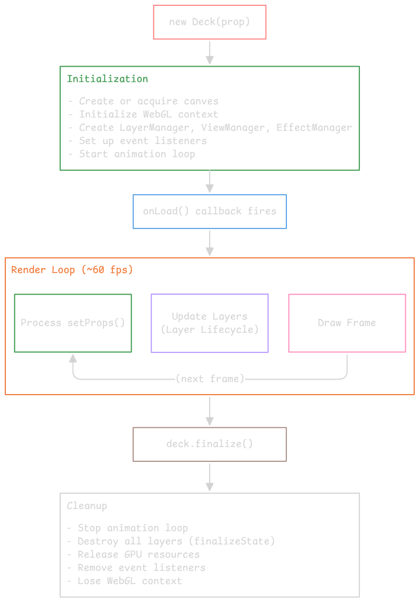
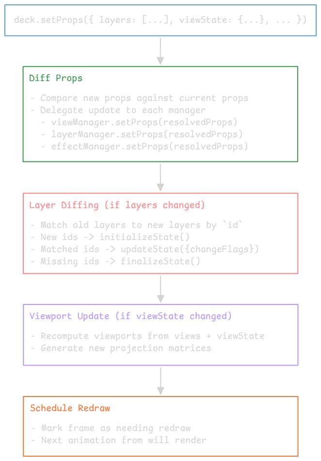

---
tags:
  - deckgl
gardening: 🌳
date: 2025-12-30
---
## Deck Instance and Lifecycle

The `Deck` class is your entry point.

### Instantiation

```typescript
import { Deck } from '@deck.gl/core';

const deck = new Deck({
  // ─────────── Canvas Configuration ───────────
  canvas: 'deck-canvas',    // String ID or HTMLCanvasElement
  parent: document.body,    // Parent element (if canvas is created)
  width: '100%',            // CSS width (string or number)
  height: '100%',           // CSS height
  
  // ─────────── WebGL Configuration ────────────
  deviceProps: {
    type: 'webgl', 
    webgl: {                // Passed to getContext('webgl2', ...)
      antialias: true,
    }
  },
  
  // ─────────── Initial State ──────────────────
  initialViewState: {
    longitude: -122.4,
    latitude: 37.8,
    zoom: 12,
    pitch: 0,
    bearing: 0,
  },
  
  // ─────────── What to Render ─────────────────
  layers: [],
  views: [new MapView({ id: 'map', controller: true })],
  
  // ─────────── Event Callbacks ────────────────
  onHover: (info, event) => {},
  onClick: (info, event) => {},
  onDrag: (info, event) => {},
  onDragStart: (info, event) => {},
  onDragEnd: (info, event) => {},
  onViewStateChange: ({ viewState, viewId, interactionState }) => {},
  
  // ─────────── Lifecycle Callbacks ────────────
  onLoad: () => {},               // Initial rendering completes
  onError: (error, layer) => {},  // Error during render
  onBeforeRender: ({ gl }) => {}, // Before each frame
  onAfterRender: ({ gl }) => {},  // After each frame
  
  // ─────────── Advanced ───────────────────────
  useDevicePixels: true,          // Render at device resolution
  pickingRadius: 0,               // Expand picking hit area (pixels)
  _typedArrayManagerProps: {},    // Memory management tuning
});
```

**_(Docs_ [1](https://deck.gl/docs/api-reference/core/deck) [2](https://luma.gl/docs/api-reference/core/device#deviceprops) [3](https://developer.mozilla.org/en-US/docs/Web/API/HTMLCanvasElement/getContext#contextattributes))**

### The Lifecycle



### Updating the Deck Instance

The Deck instance is **mutable but declaratively updated**. You do not imperatively add or remove layers; instead, you pass a new layers array to `setProps` and deck.gl diffs it by id.

```typescript
deck.setProps({
  layers: [
    new ScatterplotLayer({ id: 'points', data: newData }),
    // Omitting 'old-id' layer removes it
  ],
});
```

`setProps()` triggers the update cycle.



**_(Docs [1](https://github.com/visgl/deck.gl/blob/73c754b70fc9dcfde9cac98f24e2eca28b297204/modules/core/src/lib/deck.ts#L445))_**

### Controlled vs Uncontrolled ViewState

Deck.gl supports two patterns for managing camera state.

#### Uncontrolled

Deck manages state internally.

```typescript
const deck = new Deck({
  initialViewState: {  // ← "initial" prefix 
    longitude: -122.4,
    latitude: 37.8,
    zoom: 12,
  },
  controller: true,   // ← Deck handles input
});
```

- Deck stores viewState internally
- Controller updates viewState automatically on user input
- You can observe camera changes via onViewStateChange, but deck.gl still owns and mutates the internal view state

#### Controlled

You manage state externally.

```typescript
const [viewState, setViewState] = useState({
  longitude: -122.4,
  latitude: 37.8,
  zoom: 12,
});

const deck = new Deck({
  viewState,                    // ← No "initial" prefix
  onViewStateChange: ({ viewState: newViewState }) => {
    setViewState(newViewState); // ← You update the state
  },
  controller: true,
});

// When state changes, update deck
deck.setProps({ viewState });
```

- You own the viewState
- Can modify, constrain, animate, sync with other components
- Must wire onViewStateChange → your state → setProps

### Important Instance Methods

#### Update Configuration

```typescript
deck.setProps({
  layers: [...],
  viewState: {...},
});
```

#### Picking (Programmatic)

```typescript
const info = deck.pickObject({
  x: 100,                // Screen x
  y: 200,                // Screen y
  radius: 5,             // Search radius in pixels
  layerIds: ['points'],  // Optional: limit to specific layers
});

const infos = deck.pickMultipleObjects({
  x: 100,
  y: 200,
  radius: 10,
  depth: 5,              // Return up to 5 overlapping objects
});

const infos = deck.pickObjects({
  x: 50,                 // Bounding box left
  y: 50,                 // Bounding box top
  width: 200,            // Bounding box width
  height: 200,           // Bounding box height
  layerIds: ['points'],
});
```

#### Redraw Control

```typescript
deck.redraw(true);     // Force immediate redraw
```

#### Metrics

```typescript
const stats = deck.getMetrics();
// { fps, gpuTime, cpuTime, bufferMemory, ... }
```

#### Cleanup

```typescript
deck.finalize();     // Release GPU resources and detach event handlers
```

## Layers: Props, Data and Accessors

Every layer accepts props that fall into distinct categories:

1. **Identity**
	- `id` - unique identifier for matching across renders

2. **Data**
	- `data` - the dataset (array, URL, Promise, iterable, Arrow, etc.)
	- `dataComparator` - custom function to detect data changes
	- `dataTransform` - preprocess data before accessors run
	- `_dataDiff` - identify which indices changed (partial updates)

3. **Accessor**
	- `getPosition`, `getColor`, `getRadius`, etc.
	- Map each datum to a visual property
	- Can be: function, constant value, or binary attribute descriptor

4. **Render Style**
	- `opacity`, `visible`, `pickable`
	- Layer-specific: `radiusScale`, `lineWidthUnits`, `stroked`, etc.

5. **Interaction**
	- `pickable` - enable picking for this layer
	- `autoHighlight` - highlight hovered object
	- `highlightColor` - color for highlighted object
	- `onHover`, `onClick`, `onDragStart`, `onDrag`, `onDragEnd`

6. **Coordinate System**
	- `coordinateSystem` - COORDINATE_SYSTEM.LNGLAT, CARTESIAN, etc.
	- `coordinateOrigin` - reference point for METER_OFFSETS
	- `modelMatrix` - 4x4 transform applied to all positions
	- `wrapLongitude` - handle antimeridian crossing

7. **Extensions**
	- `extensions` - array of LayerExtension instances
	- Extension-specific props (e.g. filterRange, brushingRadius)

**_(Docs [1](https://deck.gl/docs/api-reference/core/layer))_**

### The `data` Prop

The `data` prop is flexible, it accepts many formats.

```typescript
// ────── Array of Objects (most common) ────────────────
new ScatterplotLayer({
  data: [
    { position: [-122.4, 37.8], size: 100 },
    { position: [-122.5, 37.7], size: 200 },
  ],
  getPosition: d => d.position,
  getRadius: d => d.size,
});

// ────── URL (fetched via loaders.gl) ──────────────────
new ScatterplotLayer({
  data: 'https://example.com/points.json',
  getPosition: d => d.coordinates,
});

// ────── Promise ───────────────────────────────────────
new ScatterplotLayer({
  data: fetch('/api/points').then(r => r.json()),
  getPosition: d => d.coordinates,
});

// ────── Async Iterable (streaming) ────────────────────
async function* streamPoints() {
  for await (const batch of fetchBatches()) {
    yield* batch;
  }
}
new ScatterplotLayer({
  data: streamPoints(),
  getPosition: d => d.coordinates,
});

// ────── Binary / Typed Arrays (high performance) ──────
new ScatterplotLayer({
  data: {
    length: 1000000,
    attributes: {
      getPosition: { value: new Float32Array(positionData), size: 2 },
      getRadius: { value: new Float32Array(radiusData), size: 1 },
      getFillColor: { value: new Uint8Array(colorData), size: 4 },
    },
  },
});

// ────── Apache Arrow Table ────────────────────────────
import * as arrow from 'apache-arrow';

const table: arrow.Table = loadArrowTable();
new ScatterplotLayer({
  id: 'arrow-native',
  data: {
    length: table.numRows,
    attributes: {
      getPosition: { value: table.getChild('position').toArray(), size: 2 },
      getFillColor: { value: table.getChild('color').toArray(), size: 4 },
      // You must provide binary attributes for each accessor you want
      // to avoid per‑datum JavaScript execution
    }
  }
})

// Or use the @geoarrow/deck.gl-layers library
import { GeoArrowScatterplotLayer } from "@geoarrow/deck.gl-layers";

new GeoArrowScatterplotLayer({
  id: 'geoarrow-layer',
  data: table, 
  getPosition: table.getChild('geometry'), // Automatically handles binary transfer
  getFillColor: table.getChild('colors')
});
```

**_(Docs [1](https://deck.gl/docs/api-reference/core/layer#data))_**

### Accessors

Accessors are the bridge between your data and GPU attributes. They come in three forms.

#### Function Accessor

```typescript
getPosition: (datum, { index, data, target }) => {
  // datum: the current data object
  // index: position in the data array
  // data: the value of the `data` prop
  // target: pre-allocated array for output (optimization)
  return [datum.longitude, datum.latitude];
}
```

The `target` parameter is an optimization for avoiding allocations.

```typescript
// Without target: allocates new array each call
getPosition: d => [d.lng, d.lat]  // 1M allocations for 1M points

// With target: reuses pre-allocated array
getPosition: (d, { target }) => {
  target[0] = d.lng;
  target[1] = d.lat;
  return target;  // Same array, mutated
}
```

#### Constant Value

```typescript
// All points same color
getFillColor: [255, 140, 0]      // RGB
getFillColor: [255, 140, 0, 200] // RGBA

// All points same radius
getRadius: 100
```

When a constant is provided, Deck.gl optimizes by not creating a per-instance buffer, it sets a uniform instead.

#### Binary Attribute Descriptor

(Via the main `data` property)

```typescript
data: {
  length: 2, 
  attributes: {
    // The key must match the accessor name (getPosition, getColor, etc.)
    getPosition: {
      value: new Float32Array([
        -122.4, 37.8,   // point 0
        -122.5, 37.7,   // point 1
      ]),
      size: 2,          // Number of components per vertex
      stride: 8,        // Bytes between the start of consecutive elements
      offset: 0,        // Start offset in bytes
      normalized: false
    }
  }
}
```

This bypasses accessor execution for that attribute; the typed array uploads directly to the GPU.

#### Accessor Execution Timing

Accessors run during `updateState()` when:
1. Layer is new (first mount) → All accessors run on all data
2. `data` prop changed → All accessors run on new data
3. Accessor function itself changed → That specific accessor runs on all data
4. `updateTriggers` indicate a change → Specified accessors run on all data

Accessors DO NOT run when:
- `viewState` changes (pan, zoom, rotate)
- Non-accessor props change (opacity, visible, etc.)
- Other layers update

**_(Docs [1](https://deck.gl/docs/developer-guide/using-layers#accessors))_**

### The `updateTriggers` Prop

Changing the accessor function alone does not trigger attribute recalculation; `updateTriggers` are used to tell deck.gl when to recompute attributes. This creates a problem:

```typescript
// PROBLEM: Accessor captures external state
const [colorMode, setColorMode] = useState('category');

new ScatterplotLayer({
  data: points,  // Same data reference
  getFillColor: d => {
    // Uses colorMode from closure
    if (colorMode === 'category') return categoryColor(d);
    return valueColor(d);
  },
});
```

When `colorMode` changes:
- data hasn't changed (same reference)
- `getFillColor` function is recreated, but Deck may not detect meaningful change

The solution is `updateTriggers`:

```typescript
new ScatterplotLayer({
  data: points,
  getFillColor: d => {
    if (colorMode === 'category') return categoryColor(d);
    return valueColor(d);
  },
  updateTriggers: {
    // When colorMode changes, re-run getFillColor accessor
    getFillColor: [colorMode],
  },
});
```

```typescript
// Examples:
updateTriggers: {
  getFillColor: colorMode,                    // Single dependency
  getFillColor: [colorMode, theme],           // Multiple dependencies
  getFillColor: { mode: colorMode, t: theme },// Object (shallow compared)
  getRadius: selectedId,
}
```

When any dependency changes, the corresponding accessor re-executes.

**_(Docs [1](https://deck.gl/docs/api-reference/core/layer#updatetriggers))_**

### Common Layer Properties

```typescript
// ────── ScatterplotLayer ──────────────────────────────
new ScatterplotLayer({
  // Position
  getPosition: d => d.coordinates,  // [x, y] or [x, y, z]
  
  // Size
  getRadius: d => d.size,           // In meters (default) or pixels
  radiusUnits: 'meters',            // 'meters' | 'common' | 'pixels'
  radiusScale: 1,                   // Multiplier for all radii
  radiusMinPixels: 1,               // Minimum rendered size
  radiusMaxPixels: 100,             // Maximum rendered size
  
  // Fill
  filled: true,
  getFillColor: d => d.color,       // [r, g, b] or [r, g, b, a]
  
  // Stroke
  stroked: false,
  getLineColor: [0, 0, 0],
  getLineWidth: 1,
  lineWidthUnits: 'meters',
  lineWidthScale: 1,
  lineWidthMinPixels: 0,
  lineWidthMaxPixels: Number.MAX_SAFE_INTEGER,
  
  // Interaction
  pickable: true,
  autoHighlight: true,
  highlightColor: [255, 255, 0, 128],
});

// ────── PathLayer ──────────────────────────────
new PathLayer({
  getPath: d => d.waypoints,        // Array of [x, y] or [x, y, z]
  getColor: d => d.color,
  getWidth: d => d.width,
  widthUnits: 'meters',
  widthScale: 1,
  widthMinPixels: 1,
  widthMaxPixels: Number.MAX_SAFE_INTEGER,
  capRounded: false,
  jointRounded: false,
  billboard: false,                 // If true, always faces camera
  miterLimit: 4,
});

// ────── PolygonLayer ──────────────────────────────
new PolygonLayer({
  getPolygon: d => d.contour,       // Array of [x, y] forming closed ring
  getFillColor: d => d.fill,
  getLineColor: d => d.stroke,
  getLineWidth: 1,
  filled: true,
  stroked: true,
  extruded: false,                  // 3D extrusion
  getElevation: d => d.height,      // Height for extrusion
  elevationScale: 1,
  wireframe: false,                 // Show edges when extruded
});

// ────── IconLayer ──────────────────────────────
new IconLayer({
  getPosition: d => d.coordinates,
  getIcon: d => d.iconName,         // String key into iconAtlas
  getSize: d => d.size,
  getColor: d => d.color,           // Tint color
  getAngle: d => d.rotation,        // Degrees
  
  // Icon atlas configuration
  iconAtlas: 'path/to/atlas.png',   // Spritesheet URL or Image
  iconMapping: {                    // Icon name → atlas coordinates
    marker: { x: 0, y: 0, width: 64, height: 64, anchorY: 64 },
    pin: { x: 64, y: 0, width: 64, height: 64, anchorY: 64 },
  },
  
  sizeUnits: 'pixels',
  sizeScale: 1,
  sizeMinPixels: 0,
  sizeMaxPixels: Number.MAX_SAFE_INTEGER,
  billboard: true,                  // Always face camera
});

// ────── TextLayer ──────────────────────────────
new TextLayer({
  getPosition: d => d.coordinates,
  getText: d => d.label,
  getSize: d => d.fontSize,
  getColor: d => d.color,
  getAngle: d => d.rotation,
  getTextAnchor: 'middle',          // 'start' | 'middle' | 'end'
  getAlignmentBaseline: 'center',   // 'top' | 'center' | 'bottom'
  getPixelOffset: [0, 0],           // [x, y] offset in pixels
  
  fontFamily: 'Monaco, monospace',
  fontWeight: 'normal',
  lineHeight: 1.0,
  maxWidth: -1,                     // -1 = no wrapping
  wordBreak: 'break-word',
  
  sizeUnits: 'pixels',
  sizeScale: 1,
  sizeMinPixels: 0,
  sizeMaxPixels: Number.MAX_SAFE_INTEGER,
  
  billboard: true,
  background: false,
  getBackgroundColor: [255, 255, 255],
  backgroundPadding: [0, 0],
});
```

## Views, Viewports, and Coordinate Systems

The View system controls *how* your data is projected onto the screen.

### Conceptual Model

You provide:
- View: "What kind of camera is this?". MapView, OrbitView, etc.
- ViewState: "Where is the camera right now?" `{ longitude, latitude, zoom, pitch, bearing }` or `{ target, rotationX, rotationOrbit, zoom }`

Deck.gl computes:
- Viewport: The concrete projection for this frame.
	- viewMatrix (camera position/orientation)
	- projectionMatrix (perspective/orthographic)
	- viewProjectionMatrix (combined, sent to shaders)
	- project() / unproject() methods
	- Screen bounds (x, y, width, height)

### View Types

Deck.gl provides several View classes for different projection needs.

#### MapView (Web Mercator)

```typescript
import { MapView } from '@deck.gl/core';

new MapView({
  id: 'main-map',
  
  // Position on canvas (default: full canvas)
  x: 0,
  y: 0,
  width: '100%',
  height: '100%',
  
  // Controller configuration
  controller: {
    doubleClickZoom: true,
    touchRotate: true,
    keyboard: true,
    inertia: 300,
  },
  
  // Projection options
  repeat: false,          // Repeat map horizontally at low zoom
  nearZMultiplier: 0.1,   // Near clipping plane multiplier
  farZMultiplier: 1.01,   // Far clipping plane multiplier
});

// ViewState for MapView:
const viewState = {
  longitude: -122.4,      // Camera center longitude
  latitude: 37.8,         // Camera center latitude
  zoom: 12,               // Zoom level (0 = whole world)
  pitch: 0,               // Tilt in degrees (0 = top-down)
  bearing: 0,             // Rotation in degrees (0 = north up)
  
  // Optional constraints
  minZoom: 0,
  maxZoom: 20,
  minPitch: 0,
  maxPitch: 60,
};
```

#### OrbitView (Object-Centric)

For viewing 3D objects from different angles. Camera orbits around a target point.

```typescript
import { OrbitView } from '@deck.gl/core';

new OrbitView({
  id: 'orbit',
  orbitAxis: 'Y',         // 'Y' or 'Z' (default)
  fovy: 50,               // Field of view in degrees
});

// ViewState for OrbitView:
const viewState = {
  target: [0, 0, 0],      // Point camera looks at
  rotationX: 30,          // Pitch angle in degrees
  rotationOrbit: 45,      // Orbital angle in degrees
  zoom: 1,                // Zoom level
  minZoom: -10,
  maxZoom: 10,
  minRotationX: -90,
  maxRotationX: 90,
};
```

#### FirstPersonView

Camera positioned in the scene, looking in a direction.

```typescript
import { FirstPersonView } from '@deck.gl/core';

new FirstPersonView({
  id: 'first-person',
  fovy: 75,
});

// ViewState for FirstPersonView:
const viewState = {
  longitude: -122.4,
  latitude: 37.8,
  position: [0, 0, 100],  // Offset from lng/lat in meters [x, y, z]
  bearing: 45,            // Looking direction (0 = north)
  pitch: 15,              // Looking up/down
};
```

#### OrthographicView

2D orthographic projection (no perspective distortion).

```typescript
import { OrthographicView } from '@deck.gl/core';

new OrthographicView({
  id: 'ortho',
  flipY: true,            // Flip Y axis (screen coordinates)
});

// ViewState for OrthographicView:
const viewState = {
  target: [0, 0, 0],      // Center point
  zoom: 0,                // Zoom level (0 = 1:1 pixel mapping)
  minZoom: -10,
  maxZoom: 10,
};
```

#### GlobeView (Experimental)

Renders Earth as a 3D globe rather than flat Mercator.

```typescript
import { GlobeView } from '@deck.gl/core';

new GlobeView({
  id: 'globe',
  resolution: 10,         // Subdivision level for globe mesh
});

// ViewState for GlobeView:
const viewState = {
  longitude: -122.4,
  latitude: 37.8,
  zoom: 2,
};
```

**_(Docs [1](https://deck.gl/docs/developer-guide/views) [2](https://deck.gl/docs/api-reference/core/map-view) [3](https://deck.gl/docs/api-reference/core/orbit-view) [4](https://deck.gl/docs/api-reference/core/first-person-view) [5](https://deck.gl/docs/api-reference/core/orthographic-view) [6](https://deck.gl/docs/api-reference/core/globe-view))_**

### Multi-View Rendering

Deck.gl supports rendering multiple views simultaneously.

```typescript
import { Deck, MapView, OrthographicView } from '@deck.gl/core';

new Deck({
  views: [
    // Main map on left 70%
    new MapView({
      id: 'main',
      x: 0,
      y: 0,
      width: '70%',
      height: '100%',
      controller: true,
    }),
    
    // Minimap on right 30%
    new OrthographicView({
      id: 'minimap',
      x: '70%',
      y: 0,
      width: '30%',
      height: '30%',
      controller: false,  // Minimap doesn't respond to input
    }),
  ],
  
  // ViewState per view
  viewState: {
    main: {
      longitude: -122.4,
      latitude: 37.8,
      zoom: 12,
    },
    minimap: {
      target: [-122.4, 37.8, 0],
      zoom: -2,  // Zoomed out
    },
  },
  
  // Layers render in all views by default
  layers: [...],
  
  // Dynamically decide per‑frame which layers render in which viewports
  layerFilter: ({ layer, viewport }) => {
    if (viewport.id === 'minimap') {
      // Only show certain layers in minimap
      return layer.id === 'base-layer';
    }
    return true;
  },
});
```

**_(Docs [1](https://deck.gl/docs/developer-guide/views#using-multiple-views))_**

### Coordinate Systems

Deck.gl supports multiple coordinate systems. The choice affects how position data is interpreted.

#### LNGLAT (Default)

Positions are `[longitude, latitude]` or `[longitude, latitude, altitude]`.

```typescript
new ScatterplotLayer({
  coordinateSystem: COORDINATE_SYSTEM.LNGLAT,  // Default
  getPosition: d => [d.longitude, d.latitude],
});
```

#### LNGLAT_OFFSETS

Positions are meter offsets from a reference point. Useful for high precision in local areas.

```typescript
new ScatterplotLayer({
  coordinateSystem: COORDINATE_SYSTEM.LNGLAT_OFFSETS,
  coordinateOrigin: [-122.4, 37.8],  // Reference point
  getPosition: d => [d.xMeters, d.yMeters],  // Offset from origin
});
```

#### METER_OFFSETS

Similar to LNGLAT_OFFSETS but with a cleaner mental model for purely local data because all positions are interpreted as meter offsets from `coordinateOrigin`.

```typescript
new ScatterplotLayer({
  coordinateSystem: COORDINATE_SYSTEM.METER_OFFSETS,
  coordinateOrigin: [-122.4, 37.8, 0],
  getPosition: d => [d.x, d.y, d.z],  // Meters from origin
});
```

#### CARTESIAN

Pure Cartesian coordinates, no geographic projection.

```typescript
new ScatterplotLayer({
  coordinateSystem: COORDINATE_SYSTEM.CARTESIAN,
  getPosition: d => [d.x, d.y, d.z],  // World units
});
```

This is typically paired with `OrthographicView` for non-geo visualizations.

**_(Docs [1](https://deck.gl/docs/developer-guide/coordinate-systems))_**

### The `modelMatrix` Prop

Every layer accepts a `modelMatrix` prop for applying a 4×4 transformation.

```typescript
import { Matrix4 } from '@math.gl/core';

const matrix = new Matrix4()
  .translate([100, 200, 0])    // Move 100m east, 200m north
  .rotateZ(Math.PI / 4)        // Rotate 45 degrees
  .scale([2, 2, 1]);           // Scale 2x in X and Y

new ScatterplotLayer({
  coordinateSystem: COORDINATE_SYSTEM.METER_OFFSETS,
  coordinateOrigin: [-122.4, 37.8, 0],
  modelMatrix: matrix,         // Applied to all positions
  getPosition: d => d.localPos,
});
```

**_(Docs [1](https://deck.gl/docs/api-reference/core/layer#modelmatrix))_**

### Viewport Methods

The Viewport class provides coordinate transformation methods. You can access the current viewport in callbacks.

```typescript
new Deck({
  onHover: (info) => {
    // info.viewport is the Viewport that was rendered to
    
    // Screen → World
    const [lng, lat] = info.viewport.unproject([info.x, info.y]);
    
    // World → Screen
    const [screenX, screenY] = info.viewport.project([lng, lat]);
    
    // Get meters per pixel at current zoom
    const metersPerPixel = info.viewport.metersPerPixel;
    
    // Get visible bounds
    const bounds = info.viewport.getBounds();
    // [minLng, minLat, maxLng, maxLat]
  },
});
```

## Controllers and Event Handling

Deck.gl provides two interactivity systems:
1. **Controllers** – Handle camera manipulation (pan, zoom, rotate)
2. **Picking & Events** – Handle object interaction (hover, click, drag)

### Controllers

Controllers translate user gestures into viewState changes.

#### Method 1: Boolean Shorthand

Use default controller for view type.

```typescript
new MapView({
  id: 'map',
  controller: true,  // Uses MapController
});
```

#### Method 2: Controller Object

```typescript
new MapView({
  id: 'map',
  controller: {
    // Gesture toggles
    scrollZoom: true,
    dragPan: true,
    dragRotate: true,      // Right-click or ctrl+drag
    doubleClickZoom: true,
    touchZoom: true,
    touchRotate: true,
    keyboard: true,
    
    // Behavior tuning
    inertia: 300,          // Momentum duration (ms) after gesture ends
    scrollZoomSpeed: 0.01, // Zoom sensitivity
    dragPanSpeed: 1,       // Pan sensitivity
    
    // Constraints
    minZoom: 0,
    maxZoom: 20,
    minPitch: 0,
    maxPitch: 60,
  },
});
```

#### Method 3: Custom Controller

```typescript
import { MapController } from '@deck.gl/core';

class MyController extends MapController {
  handleEvent(event) {
    // Custom event handling
    if (event.type === 'wheel' && event.shiftKey) {
      // Shift+wheel does something custom
      return;
    }
    return super.handleEvent(event);
  }
}

new MapView({
  controller: { type: MyController },
});
```

#### Controller Types

Each View type has a corresponding Controller:

| View             | Default Controller     | Primary Gestures          |
| ---------------- | ---------------------- | ------------------------- |
| MapView          | MapController          | Pan, zoom, pitch, bearing |
| OrbitView        | OrbitController        | Orbit, zoom, pan target   |
| FirstPersonView  | FirstPersonController  | Look around, move         |
| OrthographicView | OrthographicController | Pan, zoom                 |
| GlobeView        | GlobeController        | Rotate globe, zoom        |

**_(Docs [1](https://deck.gl/docs/developer-guide/interactivity) [2](https://deck.gl/docs/api-reference/core/deck#controller) [3](https://deck.gl/docs/api-reference/core/controller))_**

### Picking System

Picking determines which object is under the cursor. Deck.gl uses **color-based GPU picking**:

1. User hovers at screen position (x, y)

2. Deck.gl re-renders to offscreen framebuffer
	- Each object rendered with unique color (encoded index)
	- Object 0 → `RGB(1, 0, 0)`
	- Object 1 → `RGB(2, 0, 0)`
	- Object 255 → `RGB(0, 1, 0)`
	- Object N → `RGB((N + 1) & 0xFF, ((N + 1) >> 8) & 0xFF, ((N + 1) >> 16) & 0xFF)`

3. Read pixel at (x, y) from framebuffer
	- `gl.readPixels(x, y, 1, 1, ...)`
	- Get RGB value

4. Decode color → object index
	- `index = R + (G << 8) + (B << 16) - 1`

5. Look up object in layer's data
	- `datum = layer.props.data[index]`

6. Return PickingInfo to callbacks

[For More Info: Deck.gl Picking](interesting%20aspects/Deck.gl%20Picking.md)

#### Enabling Picking

Picking is opt-in per layer.

```typescript
new ScatterplotLayer({
  id: 'points',
  data: points,
  getPosition: d => d.coordinates,
  
  // Enable picking
  pickable: true,
  
  // Auto-highlight hovered object
  autoHighlight: true,
  highlightColor: [255, 255, 0, 128],  // Yellow, semi-transparent
});
```

#### `autoHighlight` Mechanism

The highlight is computed per-fragment on the GPU, in parallel, using data already present (instancePickingColors attribute).

When picking detects hovering over object index 12345:

1. Deck.gl sets uniform: pickingSelectedColor = encode(12345)
	- This is a single uniform update: O(1)

2. Vertex shader (runs for all instances)
```glsl
uniform vec3 pickingSelectedColor;
attribute vec3 instancePickingColors;  // Encoded index per instance

bool isPicked = all(equal(instancePickingColors, pickingSelectedColor));
```

3. Fragment shader
```glsl
if (isPicked) {
  fragColor = mix(fragColor, highlightColor, highlightColor.a / 255);
}
```

#### Event Callbacks

Events can be handled at the Deck level or Layer level.

```typescript
new Deck({
  layers: [...],
  
  onHover: (info, event) => {
    // info: PickingInfo object
    // event: original browser event
    console.log('Hovered:', info.object);
  },
  
  onClick: (info, event) => {
    console.log('Clicked:', info.object);
  },
  
  onDragStart: (info, event) => {},
  onDrag: (info, event) => {},
  onDragEnd: (info, event) => {},
});
```

```typescript
new ScatterplotLayer({
  id: 'points',
  pickable: true,
  
  onHover: (info, event) => {
    // Only fires for this layer
    if (info.object) {
      showTooltip(info.object, info.x, info.y);
    } else {
      hideTooltip();
    }
  },
  
  onClick: (info, event) => {
    if (info.object) {
      selectPoint(info.object.id);
    }
  },
});
```

#### The `PickingInfo` Object

```typescript
type PickingInfo = {
  // What was picked
  layer: Layer | null;           // Layer that was picked
  index: number;                 // Index into data array (-1 if nothing)
  object: any | null;            // data[index], the picked datum
  
  // Where it was picked
  x: number;                     // Screen x (relative to canvas)
  y: number;                     // Screen y
  coordinate: [number, number];  // World coordinate at cursor [lng, lat]
  
  // Picking context
  viewport: Viewport;            // Viewport that was rendered
  color: Uint8Array | null;      // Raw picking color (for debugging)
  
  // For sublayers (e.g., GeoJsonLayer)
  sourceLayer: Layer | null;     // Original composite layer
  
  // Custom data (layers can add extra fields)
  // e.g., PathLayer adds: segmentIndex
};
```

#### Programmatic Picking

You can pick without user interaction.

```typescript
const deck = new Deck({ ... });

// Pick single object at screen coordinate
const info = deck.pickObject({
  x: 100,
  y: 200,
  radius: 0,               // Exact point (increase for tolerance)
  layerIds: ['points'],    // Optional: limit to specific layers
  unproject3D: true,       // Include 3D coordinate
});

// Pick multiple overlapping objects
const infos = deck.pickMultipleObjects({
  x: 100,
  y: 200,
  radius: 5,
  depth: 10,               // Max number of objects to return
});

// Pick all objects in a bounding box
const infos = deck.pickObjects({
  x: 50,
  y: 50,
  width: 200,
  height: 200,
});
```

Use cases:
- Implementing custom selection tools (lasso, rectangle)
- Querying visible objects in a region
- Testing/automation

**_(Docs [1](https://deck.gl/docs/developer-guide/interactivity#picking) [2](https://github.com/visgl/deck.gl/blob/a15c8cea047993c8a861bf542835c1988f30165c/modules/core/src/lib/picking/pick-info.ts#L9) [3](https://deck.gl/docs/api-reference/core/deck#pickobject) [4](https://deck.gl/docs/api-reference/core/deck#pickmultipleobjects) [5](https://deck.gl/docs/api-reference/core/deck#pickobjects))_**

### Event Propagation

Layers stack, the last layer in your `layers` array renders on top and is picked first.

```ts
layers: [
  PolygonLayer (pickable: false)     ← Skipped
  ScatterplotLayer (pickable: true)
  IconLayer (pickable: true)
	TextLayer (pickable: true)         ← Checked first
]
```

User picks at `(x, y)`:

1. Check TextLayer at `(x, y)`
	- Hit? Return TextLayer info, stop
	- Miss? Continue

2. Check IconLayer at `(x, y)`
	- Hit? Return IconLayer info, stop
	- Miss? Continue

3. Check ScatterplotLayer at `(x, y)`
	- Hit? Return ScatterplotLayer info, stop
	- Miss? Continue

4. No more pickable layers. Return `{ object: null, index: -1 }`

To pick _through_ the top layer (get all objects at a point):

```typescript
const allObjects = deck.pickMultipleObjects({
  x: event.offsetX,
  y: event.offsetY,
  depth: 5,  // Get up to 5 overlapping objects
});
```
