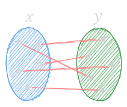

---
tags:
  - functional
gardening: 🌳
---
> Functional programming (often abbreviated FP) is the process of building software by composing **pure functions**, **avoiding shared state**, **mutable data**, and **side-effects**. Functional programming is declarative rather than imperative, and application state flows through pure functions. Contrast with object oriented programming, where application state is usually shared and co-located with methods in objects.
>
> Functional code tends to be more concise, more predictable, and easier to test than imperative or object oriented code — but if you're unfamiliar with it and the common patterns associated with it, functional code can also seem a lot more dense, and the related literature can be impenetrable to newcomers.
>
> If you start googling functional programming terms, you're going to quickly hit a brick wall of academic lingo that can be very intimidating for beginners.
>
> **Don't let all the new words scare you away. It's a lot easier than it sounds.**
>
> _Eric Elliott - What is Functional Programming?_


## Tell Me What You Are Doing, Not How To Do It: Declarative vs Imperative

You'll hear something to the effect of "[imperative](https://en.wikipedia.org/wiki/Imperative_programming) is **_how_** something is done and [declarative](https://en.wikipedia.org/wiki/Declarative_programming) is **_what_** is done" a lot. While that is essentially true, it does little to actually explain it. As any post on the subject does, let's jump to some metaphors. As someone that does a lot of work on their own car, I'll use changing the oil as the example.

**Imperative**

  * Jack up car
  * Loosen oil filler cap
  * Position drain pan
  * Remove oil drain plug
  * Allow oil to completely drain
  * Remove oil filter
  * Replace drain plug
  * Replace oil filter
  * Lower car
  * Fill with oil

**Declarative**

  * Ask your mechanic to "change the oil in my car"

The end result is the exact same, your car has fresh oil and a new oil filter. One just describes *how* it happened while the other defines *what* happened. One of the biggest things to note is that __everything declarative has some sort of imperative implementation/abstraction__. The above example assumes that the mechanic knows all the steps that are needed to change the oil in the given car. A couple code examples that illustrate the above:

**Imperative**

```js
const sumValues = arr => {
  let sum = 0;
  for(let i = 0; i < arr.length; i++) {
    sum += arr[i];
  }
  return sum;
};
```

**Declarative**

```js
const sumValues = arr => {
  return arr.reduce((acc, curr) => acc + curr, 0);
}
```

Giving each function the array `[45, 68, 34]`, they will both return `147`, again, one just describes *how* it happened while the other defines *what* happened.

## No Need to Wonder: Pure Functions

A [pure function](https://en.wikipedia.org/wiki/Pure_function) is any function that, given the input $x$, will always return the same output and produce no side-effects outside of its scope. More formally:

> a function from a set $X$ to a set $Y$ assigns to each element of $X$ exactly one element of $Y$
>
> _Wikipedia - Function (mathematics)_

Or, shortened, "A function from $X$ to $Y$ assigns $X$ to exactly one $Y$."



This is the basic $y = f(x)$ that is taught in Algebra. Given the function $f(x) = 2x + 2$ , $f(5)$ will always be $12$. Since the result of a pure function never changes, this allows us to swap out the function call with the result and not change the application.

```js
const add = (a, b) => a + b;
const displayResult = (res) => console.log(res);

displayResult(add(5, 6));
// Is the same as
displayResult(11);
```

This aspect of pure functions is referred to as "[referential transparency](../computer%20science/programming%20lang%20theory/Referential%20Transparency.md)." Also sometimes referred as [Idempotence](../mathematics/algebra/Idempotence.md). A function is called referentially transparent if it can be replaced with its corresponding result without changing the program's behavior. For, hopefully, obvious reasons, having a side-effect in `add` from the example above would break this contract. Side-effects are any externally visible (observable) change. This includes, but is not limited to, changing a global variable, outputting to `console`, saving to a database, making an API call, etc. Now, an application that doesn't make any external requests or save anything that the user does isn't very practical, or useful. The goal of using pure functions isn't to completely eliminate side-effects, but to isolate them from the rest of the application's code.

```js
let counter = 0;
// Impure - Modifies a value (counter) outside of its scope
const increment = () => ++counter;

console.log(counter);     // → 0
console.log(increment()); // → 1
console.log(counter);     // → 1
```

```js
const counter = 0;
// Pure
const increment = val => ++val;

console.log(counter);            // → 0
console.log(increment(counter)); // → 1
console.log(counter);            // → 0
```

There are a number of advantages to using pure functions in your application:
- Makes code easier to refactor as they are self-contained and self documenting.
- Thanks to referential transparency, code is easier to understand (reason about) given any input.
- Pure functions can always be memoized by their inputs, as $x \to y$ is always the same.
- Makes parallelization easier (threads, webworkers, Promises) as it doesn't rely on shared memory.
- Functions that have no side effects allow for compiler optimization techniques.

## Give A Function, Take A Function: Higher Order Function (HOF)

A [Higher Order Function](https://en.wikipedia.org/wiki/Higher-order_function) is any function that takes a function (one or more) as an argument or returns a function as its result. Most people make use of them while, maybe, not even knowing what they are or that they have a specific name. As one of the core languages that JS was modeled after, Scheme, a lot of native functions use HOFs.

```js
// Function as an argument
const transformString = (str, transformer) => transformer(str);
const hofAcronym = transformString('hof', str => str.toUpperCase());
// → HOF
```

```js
// Function as a result
const add = a => b => a + b;
// function add(a) {
//   return function(b) {
//     return a + b;
//   }
// }
const addTen = add(10);
const fivePlusTen = addTen(5);  // → 15
const fivePlusFive = add(5)(5); // → 10
```

```js
// Combining the above argument and result examples
const transformString = transformer => str => transformer(str);
const toCapitalCase = transformString(str => `${ str.charAt(0).toUpperCase() }${ str.slice(1) }`);
const fullName = `${ toCapitalCase(user.firstName) } ${ toCapitalCase(user.lastName) }`;
```

#### Native Examples

```js
Promise.then(fulfilledFunc(result), rejectedFunc(error));
Array.map(func(item, index, array));
Array.filter(func(item, index, array));
Array.reduce(func(accumulator, item, index, array));
// etc.
```


## Piecemeal Functions: Currying

[Currying](../mathematics/algebra/Curry.md) is a technique where a function that takes _n_-number of  arguments (_n_-ary) is transformed into a series of functions, each taking one argument (unary). $f(n\textrm{ arity})→f(n-1\textrm{ arity})→\text{etc}$ . Arity (/ˈæɹɪti/) is just a fancy (pinkies out) way of referring to the number of arguments that a function takes. `nullary` (0), `unary` (1), `binary` (2), `ternary` (3), `n-ary` (n) are all terms that are commonly used to describe functions solely on their number of arguments.

In a curried function, each function call returns another function that expects the next argument until all arguments are provided, and then the final result is returned. Currying a function is just taking it and converting it to a series of closures. It makes the function more modular and flexible by allowing you to partially apply arguments, creating new functions with fewer parameters.

```js
const multiply = x => y => x * y;
const double = multiply(2);
const triple = multiply(3);

console.log(double(4));  // Output: 8
console.log(triple(5));  // Output: 15
```

or

```js
const transaction = tax => price => payment => payment - price * (1 + tax);
const withSalesTax = transaction(0.07);
const buySmashBros = withSalesTax(43.95);
const buyWitcherThree = withSalesTax(38.30);
const customerOneChange = buySmashBros(60);   // → 12.97
const customerTwoChange = buyWitcherThree(50); // → 9.02
const customerThreeChange = buySmashBros(100); // → 52.97
```

Magic numbers notwithstanding, the above illustrates how currying allows you to define some constant part of the application once and then reuse it without having to continually repeat it. Which has the added benefit of reducing boilerplate and redundancies throughout the codebase.

In the strictest definition, currying will always be a unary function that returns another unary function (until all arguments are given). There's another loose term, which is sometimes used, called auto-curry. The way that auto-curry differs is that you can supply one, __or more__, arguments at a time instead of just a single argument. This is the method that I usually prefer because sometimes you have access to more than just one of the arguments at a time. Auto-curry usually requires some sort of wrapper function to allow for the one or more argument application.

Some people also label this as "partial application" but this is more of a misnomer. Partial application is a by-product of using currying (and closures in general). You are applying part of the arguments to a function. Can also think of it as effect and affect.

```js
function autoCurry(fn, arity = fn.length, ...args) {
  return arity <= args.length ?
    fn(...args) :
    autoCurry.bind(null, fn, arity, ...args);
}
const transaction = autoCurry((tax, price, payment) => payment - price * (1 + tax));
const buySmashBros = transaction(0.07, 43.95);
const buyWitcherThree = transaction(0.07, 38.30);
const customerOneChange = buySmashBros(60);   // → 12.97
const customerTwoChange = buyWitcherThree(50); // → 9.02
const customerThreeChange = buySmashBros(100); // → 52.97
```

Auto-curry is usually a lot more flexible to use as well.

```js
transaction(0.07, 43.95, 60); // → 12.97
transaction(0.07)(43.95, 60); // → 12.97
transaction(0.07, 43.95)(60); // → 12.97
transaction(0.07)(43.95)(60); // → 12.97
```

You may have noticed in the examples above that the "main" piece of data that is being acted upon is the last argument. This is a convention know as "data last." This just means that we want to put all of our "boilerplate" arguments first and lastly the data. This makes it so that we can do all of the basic partial application as soon as possible and then just keep reusing that final function. Having the data last in curried functions also lets us use them as one off functions or easily plug them into things like array methods like `map`.

```js
const transactionTotal = tax => price => price * (1 + tax);
const withSalesTax = transaction(0.07);

// Single purchase
const coffeeTotal = withSalesTax(4.95);

// Multiple
const itemsSold = [
  4.95,
  5.95,
  10.99,
  1.50,
  // ...
];

const dailyTotal = itemsSold.reduce((total, item) => total + withSalesTax(item), 0);
```

This is a change from the defacto "data first" which is usually taught in schools (explicitly or not) and is common in OOP languages.


## Nesting Functions: Composition and Compose

[Function composition](https://en.wikipedia.org/wiki/Function_composition_(computer_science)) is a technique where you combine two or more functions to create a new function. It involves applying one function to the result of another function. The result of the first function becomes the input for the next function, and so on. And it based on the [mathematical concept](https://en.wikipedia.org/wiki/Function_composition) of the same name.

Let's say you have two functions: $f(x)$ and $g(x)$. Function composition, denoted as $(f ∘ g)(x)$, means you apply $g$ to $x$ first, and then you apply $f$ to the result. In other words, $(f ∘ g)(x) = f(g(x))$.

```js
const addFive = x => x + 5;
const double = x => x * 2;
const twenty = double(addFive(5));
```

This works alright for simple things but can get confusing when you need to do several tasks in this fashion.

```js
some(long(funcs(list(val))));
```

The `compose` function is a higher-order function that facilitates function composition. It takes `n` number of functions you want to compose as arguments and returns a new function that performs the composition, in a right-to-left order. The output of the rightmost function is used as the input to the function to its left, and this process continues until all functions have been applied. 

Compose is also associative. 

`compose(f, compose(g, h)) === compose(compose(f, g), h) === compose(f, g, h)`


```js
const compose = (...fns) => x => fns.reduceRight((y, f) => f(y), x);

const addOne = (x) => x + 1;

const double = (x) => x * 2;

const addOneAndDouble = compose(double, addOne);

console.log(addOneAndDouble(3)); // Output: 8
```

This also highlights another aspect of functional programming, __point-free style__. Point-free style, also known as [tacit programming](https://en.wikipedia.org/wiki/Tacit_programming), "is a programming paradigm in which function definitions do not identify the arguments (or "points") on which they operate." Point-free is largely used during function composition but can also be used with a variety of HOFs.

```js
const double = val => val * 2;
const ints = [5, 10, 15, 20];
const doubles = ints.map(double);
```

The restrictive part of function composition is that each function needs to be unary since it only receives the return of the previous function. When combining currying and composition together, it allows for more complex compositions.

```js
// utils.js
export const sort = fn => arr => [...arr].sort(fn);
export const filter = fn => arr => arr.filter(fn);
export const page = perPage => page => arr => arr.slice((page - 1) * perPage, perPage * page);
```

```js
import { sort, filter, page } from utils.js
const PER_PAGE = 100;
const currentPage = 1;
const displayPage = page(PER_PAGE);
const sortUserNames = sort((a, b) => a.name > b.name ? 1 : a.name < b.name ? -1 : 0);
const filterActive = filter(x => x.isActive);
const getActiveUsersByPage = page => compose(
  displayPage(page),
  sortUserNames,
  filterActive
);
const activeUsers = getActiveUsersByPage(currentPage)(users);
```


## Reversed Compose: Pipe

Pipe is functionally the same as `compose`. The only difference is where `compose` is right-to-left, `pipe` is left-to-right. This makes it easier for some to read as its their normal (language) the flow.

```js
const pipe = (g, f) => (x) => f(g(x));

const addOne = (x) => x + 1;

const double = (x) => x * 2;

const addOneAndDouble = pipe(double, addOne);

console.log(addOneAndDouble(3)); // Output: 7
```


## Spectacled Objects: Lenses

Functional object lenses provide a way to focus on and manipulate specific properties or substructures within complex data structures, such as objects or nested data, in a functional and composable manner. Functional lenses allow you to access, modify, and update data while maintaining immutability. A lens typically consists of two main operations:

  * **get**: This operation allows you to extract a specific property or substructure from the larger data structure, like an object. It returns the focused part of the data. The get operation is pure and doesn't modify the original data; it only provides a view into it.
  * **set**: This operation enables you to modify the focused property or substructure and produce a new data structure with the changes. It takes the new value and the original data, returning a modified copy of the data. Like get, the set operation doesn't mutate the original data; it creates an updated version.

Lenses work with immutable data, ensuring that the original data remains unchanged. This is crucial in functional programming, where immutability is a fundamental concept.

You can compose lenses to focus on nested properties or substructures of an object. This allows you to work with complex data structures by chaining lenses together, creating a path to the data you want to manipulate.

Lenses abstract away the details of accessing and modifying specific properties. Once you create a lens for a property, you can reuse it to read and update that property in different objects or data structures.

This lets you move away from having deep dives into the shape of a particular object. You can just import a lens. And if the structure of the data ever changes, you can change it in the lens, and none of the rest of the codebase needs to be updated.

Lenses also have laws, algebraic axioms, which ensure the correctness of the lens.

  * **Retention (SetGet)** - If you `set` a value and immediately `get` the value, through the lens, you get the value that was set.
    * `get(lens)(set(lens)(name)(person)) ≡ name`
    * `expect(lens.get(lens.set(person)(name))).toEqual(name);`

  * **Identity (GetSet)** - If you `get` the value and then immediately `set` that value back into the store, the object is unchanged.
    * `set(lens)(get(lens)(store))(store) ≡ store`
    * `expect(lens.set(person)(lens.get(person))).toStrictEqual(person);`

  * **Double Set (SetSet)** - If you `set` a lens value to `a` and then immediately set the lens value to `b`, it's the same as if you'd just set the value to `b`.
    * `set(lens)(b)(set(lens)(a)(store)) ≡ set(lens)(b)(store)`
    * `expect(lens.set(lens.set(person)(name1))(name2)).toEqual(lens.set(person)(name2));`